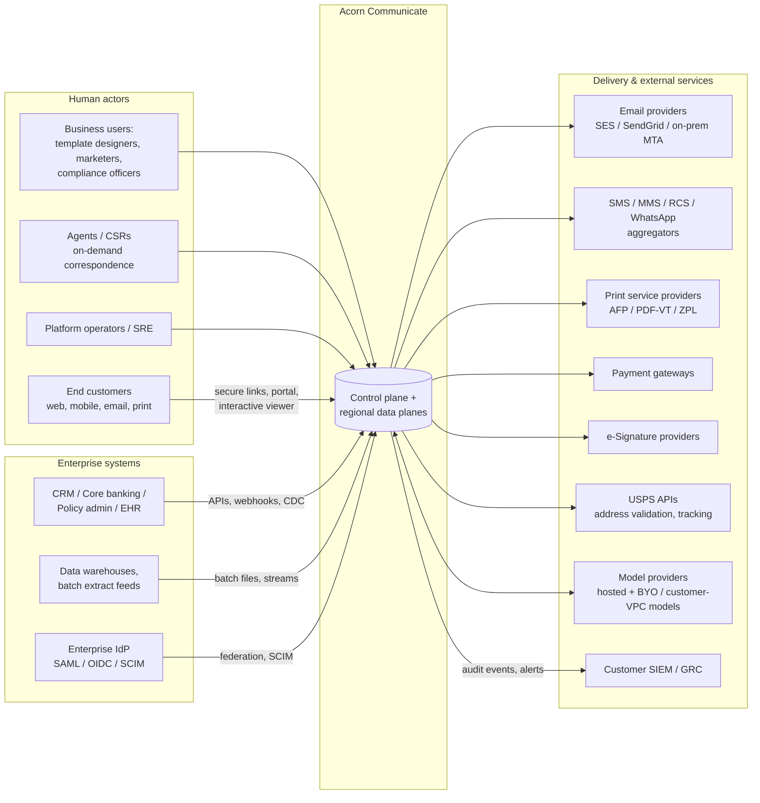
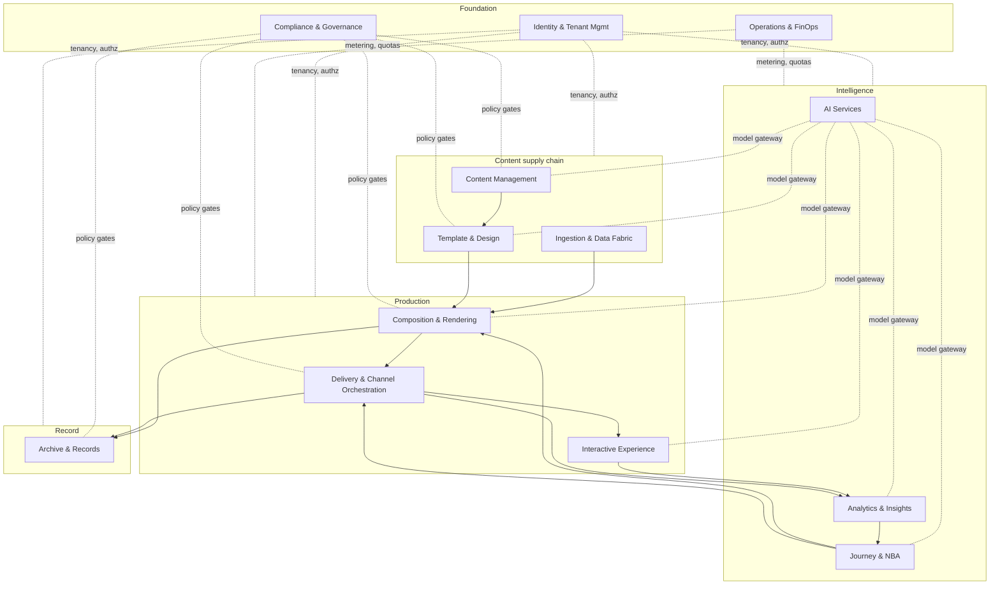
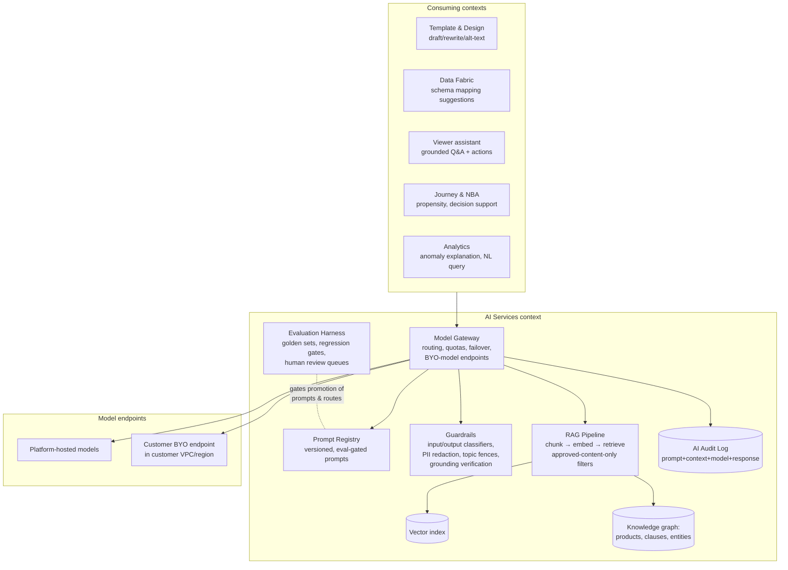
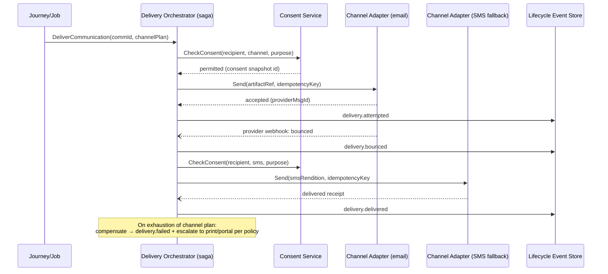
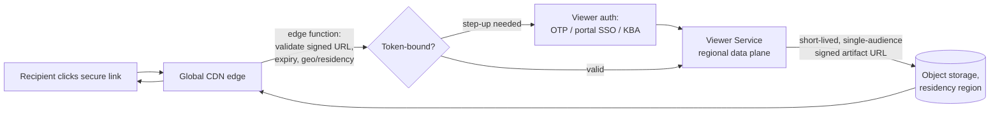
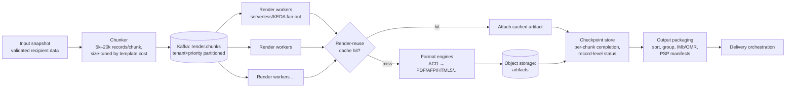
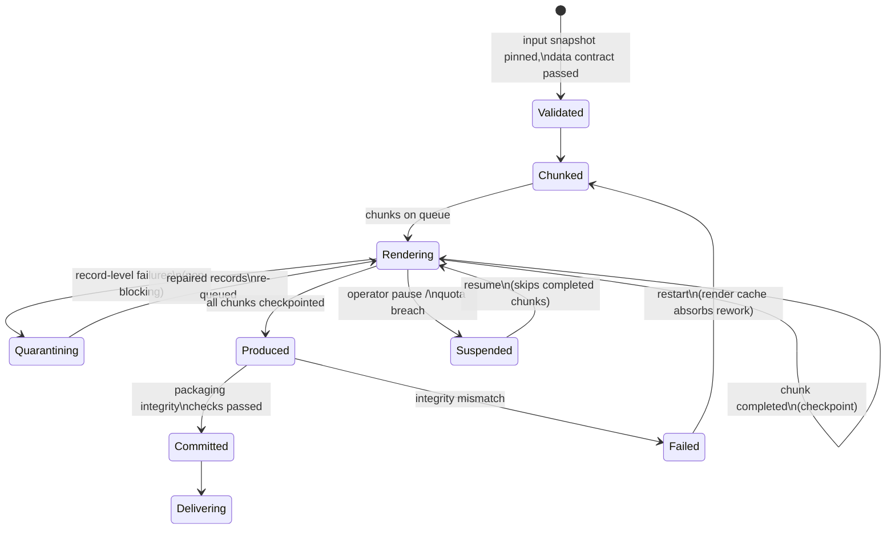
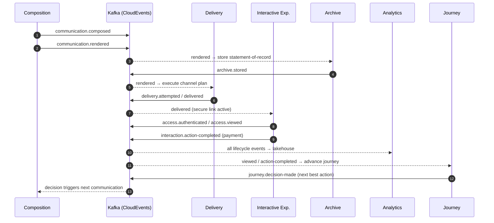
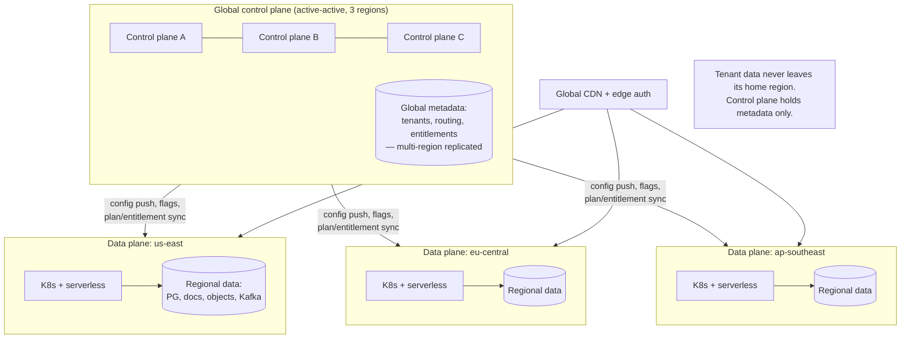
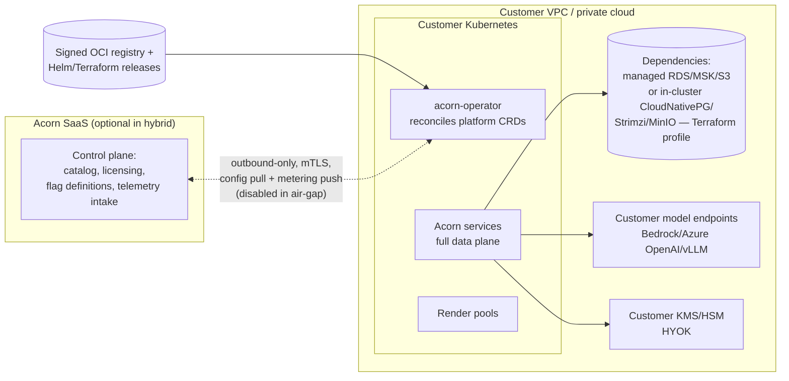

# Acorn Communicate — Target Architecture

**Document:** 04-architecture.md
**Status:** Approved for build
**Audience:** Engineering, SRE, Security, Product Architecture
**Scope:** Full-platform target architecture for Acorn Communicate — the AI-native, multi-tenant customer communication platform unifying CCM, CXM, IXM, and AIXM capabilities for regulated enterprises.

---

## 1. Architecture Principles

These principles are binding. Deviations require an ADR with explicit sign-off from the architecture board.

| # | Principle | What it means in practice |
|---|-----------|---------------------------|
| P1 | **Cloud-native** | Everything runs as containers on Kubernetes or as managed serverless functions. No VM-pinned software, no shared mutable filesystems, no snowflake infrastructure. Infrastructure is declared (Terraform + Helm), never hand-built. |
| P2 | **API-first** | Every capability is exposed via a versioned API before any UI consumes it. REST APIs are OpenAPI 3.1-described, contract-tested in CI, and published to the developer portal. UIs (admin console, designer, viewer) are pure API clients. |
| P3 | **Event-driven** | State changes are published as events; downstream contexts react asynchronously. Synchronous calls are reserved for request/response semantics the caller genuinely needs (auth checks, on-demand render). Events are the integration backbone, not an afterthought. |
| P4 | **AI-native** | AI is a platform layer, not a bolt-on. Every domain exposes AI hooks (draft, summarize, classify, decide, assist) through one Model Gateway with routing, guardrails, evaluation, and audit. No service calls a model provider directly. |
| P5 | **Multi-tenant by design** | Every row, object, event, index entry, and cache key carries a `tenant_id`. Tenant context is propagated end-to-end (JWT claim → mesh header → event attribute). Isolation level is a deployment choice per tenant, not a code fork. |
| P6 | **Domain-driven, bounded contexts** | Thirteen bounded contexts, each owning its data and schema. Cross-context access is via API or event only — never shared tables. Context maps are explicit; anti-corruption layers guard legacy/external integrations. |
| P7 | **Cost-optimized** | Autoscale to zero where possible (serverless render fan-out, event processors). Workload isolation via priority classes and node pools. Render-reuse cache eliminates duplicate composition work. Storage lifecycle tiers hot → warm → cold/WORM automatically. Cost is a first-class metric with per-tenant attribution (FinOps context). |
| P8 | **Standards-based** | OpenAPI 3.1 for REST; AsyncAPI 3.0 for event catalogs; CloudEvents 1.0 envelope for all events; OpenTelemetry for traces/metrics/logs; OAuth 2.1/OIDC for identity; SCIM 2.0 for provisioning; PDF/UA + WCAG 2.2 AA for accessibility; FHIR/ACORD/ISO 20022 adapters at the edge, not in the core. |

Two derived rules worth stating explicitly:

- **Compose once, render many.** Composition produces a channel-neutral intermediate (ACD — Acorn Composed Document, a structured JSON+asset bundle). Format engines transform ACD to HTML5, PDF, AFP, etc. This is the single most important structural decision in the platform (see ADR-06).
- **The event stream is the system of record for lifecycle.** What happened to a communication (composed → rendered → delivered → viewed → acted-on → archived) is an immutable, replayable event stream (see ADR-01).

---

## 2. System Context



---

## 3. Domain Map — Bounded Contexts



### 3.1 Context responsibilities and owned data

Each context owns its schema exclusively; the "Owned data" column is authoritative for data ownership disputes.

| Context | Responsibilities | Owned data |
|---|---|---|
| **Identity & Tenant Management** | Tenant lifecycle (partner → tenant → workspace → brand); OIDC/SAML federation; SCIM provisioning; RBAC/ABAC policy store; API keys and service accounts; per-tenant key management (BYOK/HYOK envelope keys); residency and isolation-tier assignment; feature-pack entitlements. | Tenants, workspaces, brands, users, roles, policies, entitlements, key references, residency assignments. |
| **Ingestion & Data Fabric** | Connector framework (SFTP/S3 batch files, JDBC/CDC, REST/webhook, Kafka in); schema detection and declarative mapping; validation with quarantine + repair queues; PII/PHI detection and classification tagging; identity matching (deterministic + probabilistic) and householding; address hygiene and postal enhancement via modern USPS APIs (OAuth-based Addresses 3.0 for validation/standardization, Address Correction, Informed Delivery / IMb tracking hooks); recipient data snapshots handed to composition. | Connector configs, mapping specs, data contracts, validation rules, quarantine records, match/household graphs, immutable per-job recipient data snapshots, PII classification tags. |
| **Content Management** | Reusable content objects (clauses, paragraphs, disclosures, images, charts); versioning with immutable version history; approval workflows; content lineage (which communication used which version); localization variants; metadata and taxonomy. | Content objects + versions, approval records, lineage graph, taxonomy, locale variants. |
| **Template & Design** | Template model (layout + slots + rules + variables); shared component library; brand systems (tokens: color, type, spacing, logos) applied at render time; multi-channel preview with synthetic and sampled data; template versioning, diff, and promotion (dev → test → prod); accessibility linting at design time. | Templates + versions, components, brand token sets, preview configurations, promotion state. |
| **Composition & Rendering** | Render orchestration (batch fan-out and on-demand); data-to-template binding; ACD generation; format engines: HTML5 interactive, PDF / PDF-A / PDF-UA / PDF-VT, Word (DOCX), email (MJML → responsive HTML), Excel/PowerPoint, print streams (AFP, PCL, PostScript, ZPL, TIFF, line-data), personalized video/audio (scene-graph + TTS pipeline); render-reuse cache keyed by (template-version, content-versions, brand-version, data-fingerprint, format); output packaging (banner pages, OMR/IMb marks, envelope grouping). | Render jobs, chunk/checkpoint state, ACD documents, render cache index, format-engine configs, output packages. |
| **Delivery & Channel Orchestration** | Channel adapters: email, SMS/MMS/RCS, WhatsApp, push, in-app, secure-link, portal, chat, voice/IVR, print/PSP handoff; preference and consent enforcement before every send (hard gate); channel failover chains and retry policies; provider reconciliation (bounce/complaint/DSN/PSP manifest ingestion); suppression lists; delivery windows and quiet hours per jurisdiction. | Delivery attempts + receipts, channel/provider configs, consent snapshots-at-send, suppression lists, failover policies, reconciliation ledgers. |
| **Interactive Experience** | Secure document viewer service (token-bound, short-lived signed access); interactive HTML5 documents with embedded actions: payments, disputes, form fill, document upload, e-signature, appointment scheduling; embedded grounded AI assistant scoped to the open document + approved knowledge; session capture (section views, dwell, action funnels) with consented granularity. | Viewer sessions, access tokens, action definitions + submissions, assistant conversation transcripts (per retention policy), session event buffers. |
| **AI Services** | Model Gateway: routing by task/cost/latency/residency, BYO-model and customer-VPC model endpoints, provider failover; RAG pipeline over approved content only (ingestion → chunking → embedding → retrieval with tenant + version + approval filters); vector search service; knowledge graph of products/entities/regulatory clauses; prompt registry with versioned, evaluated prompts; evaluation harness (golden sets, regression gates, human review queues); guardrails (input/output classifiers, PII redaction, topic fences, grounding checks); full AI audit trail (prompt, context, model, response, decision). | Model routes, provider credentials (vaulted), embeddings + vector indexes, knowledge graph, prompt registry, eval datasets + results, guardrail policies, AI audit log. |
| **Journey & NBA** | Journey engine (state machines over lifecycle events); decisioning service combining business rules + propensity models + eligibility; next-best-action/next-best-channel recommendations; frequency capping and contact governance; experiment arm assignment. | Journey definitions + instances, decision tables/rulesets, model scores cache, contact-governance counters, arm assignments. |
| **Analytics & Insights** | Event collection (first-party pixel-free viewer telemetry + lifecycle events); lakehouse tables (bronze/silver/gold); dashboards (delivery health, engagement, journey funnels, AI usage, cost); A/B testing with sequential-analysis stats; anomaly detection (delivery-rate drops, bounce spikes, cost anomalies). | Lakehouse datasets, dashboard/metric definitions, experiment definitions + results, anomaly baselines. |
| **Archive & Records** | Immutable statement-of-record: exact rendered artifact + data snapshot + template/content versions + delivery evidence; WORM object storage with compliance locks; retention schedules per record class and jurisdiction; legal hold (overrides retention); eDiscovery search + export with chain-of-custody manifests (hash trees, signed exports). | Archive records + manifests, retention schedules, legal holds, hold/audit trails, export packages. |
| **Compliance & Governance** | Policy-as-code engine (OPA/Rego bundles) evaluated at design, approval, render, and delivery gates; approval workflow definitions; evidence packs (auto-assembled proof of who approved what, which policy versions applied); accessibility gates (PDF/UA validation, WCAG checks) that block promotion/production on failure; regulatory rule packs per industry/jurisdiction. | Policy bundles + versions, gate results, evidence packs, accessibility reports, regulatory pack mappings. |
| **Operations & FinOps** | Platform health and capacity management; per-tenant usage metering (renders, deliveries, storage, AI tokens, viewer sessions); quota and rate-limit administration; cost allocation and showback/chargeback; SLO dashboards and error budgets; deployment orchestration hooks. | Meters, quotas, rate-limit configs, cost allocation ledgers, SLO definitions + burn data. |

### 3.2 AI Services — internal architecture

AI Services is the most cross-cutting context and warrants its own decomposition. All AI traffic — designer copilots, data-mapping suggestions, template intelligence, the embedded viewer assistant, journey decisioning models, anomaly explanation — flows through this stack:



Non-negotiable invariants:

- **Grounding boundary**: the viewer assistant retrieves only from (a) the open communication's ACD, (b) tenant content objects in `approved` state matching the recipient's product/locale, and (c) the tenant knowledge graph. Retrieval filters are enforced in the RAG service, not in prompts.
- **Residency-aware routing**: model routes carry a residency constraint; a tenant pinned to `eu-central` never has inference traffic leave the region unless the tenant explicitly configures an exception.
- **Determinism where it matters**: decisioning (NBA, eligibility) uses versioned models + versioned rules with recorded inputs — every automated decision is reproducible for regulators.
- **Kill switches**: every AI feature has a per-tenant flag; guardrail policy updates propagate without redeploys.

### 3.3 Context integration rules

- **Commands** (synchronous, OpenAPI): only along the arrows in the domain map, always tenant-scoped, always via the mesh with mTLS + authz.
- **Events** (asynchronous, CloudEvents on Kafka): any context may subscribe to any published event; producers never know consumers.
- **Shared-nothing data**: cross-context reads of another context's store are forbidden; use its API, subscribe to its events, or consume its CDC stream into your own read model.

---

## 4. Runtime Architecture

### 4.1 API architecture and standards

- **Gateway-fronted, three API planes**:
  - *Management APIs* (`api.acorn.io/mgmt/v1`): tenant admin, templates, journeys, policies — control-plane hosted, globally available.
  - *Production APIs* (`{region}.api.acorn.io/prod/v1`): job submission, on-demand render, delivery status — data-plane regional.
  - *Experience APIs* (`viewer.acorn.io`, tenant-CNAME-able): viewer bootstrap, actions, assistant — CDN-edge accelerated.
- **Versioning**: URI major versions (`/v1`), additive-only within a major; deprecations announced ≥ 12 months ahead with per-tenant usage telemetry to drive migration.
- **Conventions**: cursor pagination; RFC 9457 problem-details errors; idempotency-key header honored on all POSTs with side effects; field masks for sparse responses; per-endpoint rate-limit headers.
- **Async pattern**: long operations return `202` + operation resource; completion via polling or signed webhooks (HMAC + replay-window protection). Webhook payloads are CloudEvents — the same schema as the internal taxonomy, so customers integrate once.
- **Contract enforcement**: OpenAPI specs live with the code; CI runs breaking-change detection (oasdiff) and publishes to the developer portal on merge. SDKs (TypeScript, Java, Python, C#) are generated per release.

### 4.2 Compute model

| Workload shape | Runtime | Examples |
|---|---|---|
| Long-lived, stateful-ish services | Kubernetes Deployments/StatefulSets | API services, journey engine, viewer service, model gateway |
| Bursty, embarrassingly parallel | Serverless functions / KEDA-scaled jobs | Render fan-out workers, event enrichment, webhook fan-out, thumbnail/preview generation |
| Scheduled/batch | Kubernetes Jobs + workflow engine (Argo Workflows) | Batch production pipelines, retention sweeps, lakehouse compaction |
| Edge | CDN functions | Signed-URL validation, viewer bootstrap, geo/residency routing |

- **Service mesh** (Istio or Linkerd — see ADR-04): mTLS everywhere, SPIFFE workload identity, L7 authorization policies (context A may call context B's API only if the context map allows it), retries/timeouts/outlier ejection as mesh config, not app code.
- **API gateway** at the edge: OIDC token validation, tenant resolution, coarse rate limiting per tenant/API key, request signing for webhooks, OpenAPI-driven request validation, WAF integration.
- **Streaming backbone**: Kafka (or the cloud equivalent — MSK, Confluent, Event Hubs with Kafka protocol) for all lifecycle events, CDC, and batch chunk coordination. Topics are tenant-partitioned; large-tenant isolation via dedicated topic sets when needed.

### 4.3 CQRS + event sourcing for the communication lifecycle

The **communication lifecycle** (per-communication history from composition through archive) is event-sourced:

- **Write side**: the Lifecycle Command service validates commands, appends immutable events to the `communication.lifecycle` event store (Kafka compacted-by-key + long-retention tier, mirrored to object storage for infinite replay). The event stream *is* the history — no mutable "communication status" row is authoritative.
- **Read side**: projectors build purpose-specific read models — a relational "communication status" projection for operator dashboards and APIs, a search-index projection for lookup ("show me everything sent to customer X"), and lakehouse projections for analytics.
- **Replayability**: any read model can be rebuilt from the stream; new projections (e.g., a future SLA report) are backfilled by replay.
- **Scope discipline**: event sourcing applies to the lifecycle aggregate only. Configuration-style domains (templates, tenants, policies) use conventional CRUD with audit tables — event sourcing everywhere is complexity without payoff (ADR-01).

### 4.4 Sagas for delivery orchestration

Delivery is a saga per communication-channel attempt, coordinated by the Delivery Orchestrator (an orchestration-style saga, not choreography, because failover chains need central sequencing):



### 4.5 Idempotency and exactly-once-effect

True exactly-once delivery does not exist across third-party providers; we engineer **exactly-once *effect***:

1. **Deterministic idempotency keys**: `hash(tenant, communication_id, channel, attempt_no)` attached to every send; adapters pass provider-native idempotency where supported (SES, Twilio, WhatsApp BSPs) and keep a local dedupe ledger (Redis + relational fallback, 7-day window) where not.
2. **Transactional outbox** in every service that both writes state and emits events — state change and event enqueue commit atomically; a relay publishes to Kafka. No dual-write bugs.
3. **Consumer-side dedupe**: all event consumers are idempotent by design, keyed on CloudEvents `id`; processing offsets commit only after effect + dedupe record.
4. **Reconciliation as backstop**: daily provider reconciliation (DSN logs, PSP manifests, aggregator reports) diffed against the delivery ledger; discrepancies raise `delivery.reconciliation-mismatch` events routed to operations.

### 4.6 Resilience patterns (standard toolbox)

| Failure mode | Pattern | Where enforced |
|---|---|---|
| Downstream provider slow/down | Circuit breaker + outlier ejection; failover to secondary provider per channel | Mesh + channel adapter config |
| Kafka partition unavailability | Producer retries with outbox replay; consumers resume from committed offset | Chassis library |
| Render engine crash on poison input | Record-level quarantine; chunk continues; engine sandboxed per-process | Render worker supervisor |
| Regional dependency brownout | Load shedding by priority class (economy batch pauses first); admission control at gateway | Priority-aware schedulers |
| Duplicate webhook/event delivery | Consumer dedupe on CloudEvents `id`; provider replay-window checks | Chassis + adapter |
| Thundering-herd on cache expiry | Request coalescing + jittered TTLs in render-reuse and viewer caches | Cache client library |
| Clock skew across services | All ordering decisions use event-store sequence, never wall clock | Lifecycle event store |

---

## 5. Data Architecture

### 5.1 Store-per-purpose

| Store | Technology class | Holds | Notes |
|---|---|---|---|
| Relational (PostgreSQL) | Transactional | Tenants, users, jobs, delivery ledger, consent snapshots, lifecycle read models | Schema-per-tenant in pooled tiers; database-per-tenant in siloed tiers. Row-level security as defense-in-depth. |
| Document store (MongoDB-class / DocumentDB) | Semi-structured | Templates, ACD intermediates (hot), content metadata, connector/mapping configs, journey definitions | Versioned documents; JSON-schema-validated on write. |
| Object storage (S3-class) | Blobs | Rendered artifacts, media, data snapshots, archive packages, event-stream cold mirror | Lifecycle: hot (0–30d) → infrequent (30–180d) → cold/Glacier-class; archive bucket uses Object Lock **compliance mode** (WORM) with retention set per record class. |
| Search index (OpenSearch) | Inverted index | Communication lookup, archive search, eDiscovery queries, operational log search | Per-tenant index aliases; archive indices are point-in-time snapshotted alongside WORM data. |
| Vector DB (pgvector default; pluggable — see ADR-08) | Embeddings | RAG retrieval over approved content, semantic template/content search, near-duplicate content detection | Mandatory metadata filters: tenant, approval status, content version, locale. |
| Lakehouse (Iceberg on object storage + Spark/Trino) | Analytical | Lifecycle event history, journey funnels, engagement, cost/usage marts | Bronze = raw CloudEvents; silver = conformed; gold = metric marts. |
| Cache (Redis) | Ephemeral | Render-reuse index, session state, rate counters, dedupe ledgers | Never a system of record. |

### 5.2 Data movement

- **CDC out**: Debezium-class CDC from relational stores → Kafka → lakehouse and customer-facing data-share endpoints (customers can subscribe to their own delivery/engagement CDC feed).
- **CDC in**: customer CDC streams accepted by Ingestion & Data Fabric as first-class connectors.
- **Snapshots**: every batch job pins an immutable recipient-data snapshot in object storage; composition reads only the snapshot — reproducibility for audit and re-render.

### 5.3 Storage lifecycle and retention

| Data class | Hot | Warm | Cold / WORM | Deletion primitive |
|---|---|---|---|---|
| Rendered artifacts (non-record) | 30 d (S3 standard) | 180 d (IA) | Glacier-class to policy max | Lifecycle expiry |
| Statements of record | 90 d hot copy for viewer | — | WORM (Object Lock, retention per record class: 7 y default banking, 10 y insurance, state-specific healthcare) | Retention expiry only; legal hold overrides |
| Recipient data snapshots | Duration of job + 90 d | — | WORM alongside record | Crypto-shred on tenant offboarding |
| Lifecycle event stream | 30 d Kafka | 13 mo warm mirror | Infinite object-storage mirror (replay source) | Tokenized; crypto-shred keys per tenant |
| Viewer session telemetry | 90 d | Lakehouse silver 25 mo | Aggregates only thereafter | TTL + consent-driven purge |
| AI audit log | 90 d hot | 7 y WORM | — | Retention expiry |
| Assistant transcripts | Per-tenant policy (default 90 d) | — | Optional archive with record | Consent-driven purge |

Right-to-be-forgotten is implemented as **crypto-shredding of per-recipient derived keys** for tokenized data plus targeted purge of hot stores; WORM records are exempt where a statutory retention basis exists (documented per record class), and the exemption itself is logged as evidence.

### 5.4 Secure document access via global CDN



- Links are signed, expiring (default 30 days for notification links; artifact URLs live ≤ 5 minutes), and **token-bound**: the artifact URL is minted per authenticated viewer session and bound to session + device fingerprint claims, so a leaked artifact URL is useless.
- CDN caches only non-sensitive viewer shell assets; document payloads are cached at edge **only** with per-session cache keys and short TTL, or not at all for PHI-classified content (policy-driven).
- Residency: edge function routes to the tenant's home region; documents never transit out-of-region origins.

---

## 6. Batch + Real-Time Production

### 6.1 High-volume batch pipeline

**Throughput target: 5M rendered communications/hour per regional data plane sustained (print-stream heavy mix ≥ 2M/hour), horizontally scalable by adding worker capacity.**



Design rules:

- **Chunking**: chunk size auto-tuned per template render cost so each chunk targets 30–90s of worker time; keeps retry blast radius small and autoscaling responsive.
- **Checkpointing & restartability**: chunk completion and per-record status are durably checkpointed; job restart skips completed chunks; a poisoned record is quarantined (with reason) without failing its chunk; job-level restart is idempotent end-to-end (render-reuse cache makes re-execution cheap).
- **Render-reuse cache**: cache key = `(template_ver, content_vers[], brand_ver, format, data_fingerprint)`. Static-heavy documents (e.g., regulatory inserts, T&C pages) achieve >90% hit rates; shared page fragments are cached sub-document for engines that support merge (AFP medium maps, PDF-VT parts).
- **Backpressure**: workers consume by priority class; chunk topic lag drives KEDA scaling; per-tenant in-flight caps prevent one tenant's 20M-record job from starving others.
- **Two-phase completion**: a batch is "produced" when all chunks checkpoint, and "committed" only after packaging integrity checks (record counts, page counts, hash manifest vs. input snapshot) pass — the manifest is part of the archive evidence.

Batch job lifecycle (the states are themselves lifecycle events, so job progress is observable through the same taxonomy):



Throughput math (sizing sanity check for the 5M/hour target): at an average 350 ms/document composite render cost (post-cache blend), one worker vCPU sustains ~10k documents/hour; 5M/hour therefore needs ~500 worker vCPUs — a KEDA fan-out of 125 four-vCPU pods, well within a single node-pool's burst envelope. Print-heavy mixes (AFP at ~800 ms blended) size to ~1,100 vCPUs, which is why `bulk-economy` runs on spot capacity.

### 6.2 On-demand low-latency path

**SLO: p95 < 2s from API request to first-byte of rendered artifact** (interactive HTML5 and single-document PDF).

- Dedicated **on-demand render pool**: warm workers (no cold start), template + brand bundles pre-compiled and cached in-process, data fetched from request payload or a single upstream call.
- Bypasses Kafka: synchronous gRPC from API → render pool, with the lifecycle events emitted asynchronously via outbox after response.
- Degradation ladder: cache hit (~100ms) → warm render (~600ms–1.5s) → cold path returns `202` + webhook/poll beyond 2s budget rather than blocking.

### 6.3 Priority classes and workload isolation

| Priority class | Use | Guarantees |
|---|---|---|
| `interactive` | On-demand render, viewer, assistant | Dedicated node pool + warm pools; never preempted |
| `realtime-batch` | Event-triggered communications (alerts, OTP-adjacent) | < 60s end-to-end target; preempts bulk |
| `bulk-high` / `bulk-standard` / `bulk-economy` | Scheduled batch tiers (priced accordingly) | Economy runs on spot/preemptible capacity |

Per-tenant: concurrency quotas, queue-depth quotas, and token-bucket rate limits enforced at gateway and at chunk-consumer level. Large regulated tenants can purchase **reserved render capacity** (dedicated worker pool pinned via node selectors).

---

## 7. Multi-Tenancy & Tenant Model

### 7.1 Tenant hierarchy

```
Partner (reseller / SI / program manager)
 └── Tenant (the customer legal entity; unit of isolation, billing, residency, keys)
      └── Workspace (division / LOB / environment: dev, test, prod)
           └── Brand (visual identity + sending identities + channel credentials)
```

- Entitlements and feature packs attach at tenant, overridable per workspace.
- All authorization is evaluated against the full path (`partner/tenant/workspace/brand`) via ABAC policies.

### 7.2 Isolation models (per-tenant deployment choice, same codebase)

| Tier | Compute | Data | Typical customer |
|---|---|---|---|
| **Pooled** | Shared services, tenant-partitioned | Shared clusters, schema-per-tenant + RLS, per-tenant KMS keys | Mid-market SaaS |
| **Siloed namespace** | Dedicated K8s namespaces + node pools, shared control plane | Dedicated DB instances/buckets | Enterprises wanting stronger blast-radius limits |
| **Dedicated cluster** | Dedicated regional cluster, Acorn-operated | Fully dedicated stores | Large regulated enterprises |
| **Customer-VPC** | Helm/Terraform install in customer account; customer-operated or Acorn-managed | Everything in customer boundary; control-plane connection optional (air-gap mode supported) | Government, health systems, top-tier banks |

### 7.3 Encryption and keys

- Envelope encryption everywhere; **per-tenant data keys** wrapped by tenant KMS keys.
- **BYOK**: tenant key lives in platform KMS, imported/controlled by customer, revocation = crypto-shredding.
- **HYOK**: tenant key stays in customer's KMS/HSM (external key store); the platform requests unwrap operations — customer can cut access unilaterally. Available on siloed tiers and above.
- Field-level encryption for PII/PHI columns classified by the Data Fabric, on top of storage-level encryption.

### 7.4 Noisy-neighbor controls and tenant configuration

- Quotas (API rps, render concurrency, event throughput, AI tokens/day), enforced with per-tenant token buckets and Kafka quota plugins; breach → throttle + `finops.quota-exceeded` event, never silent drop.
- Priority inheritance: a tenant's plan maps to default priority classes; per-job overrides bounded by plan ceiling.
- **Feature packs**: declarative bundles (e.g., "Healthcare pack" = PHI handling defaults + HIPAA policy bundle + FHIR connector) toggled per tenant; flags evaluated via the central feature-flag service with tenant targeting.
- **Data residency routing**: tenant home region is immutable metadata; the global control plane routes all data-plane operations to the home region; cross-region features (global search across a partner's tenants) operate on metadata only.

---

### 7.5 Tenant onboarding flow

Onboarding is fully automated and idempotent — a `Tenant` resource applied to the control plane drives everything:

1. **Provision**: control plane assigns home region + isolation tier; the regional operator creates namespace/node-pool (siloed tiers), database schema or instance, object-storage prefixes/buckets with encryption config, Kafka quotas/topics, and search/vector index aliases.
2. **Keys**: tenant KMS key created (or BYOK import / HYOK external-store binding validated with a round-trip unwrap test).
3. **Identity**: IdP federation configured (OIDC/SAML metadata exchange), SCIM endpoint issued, break-glass admin created with mandatory rotation.
4. **Feature packs & policy bundles**: plan entitlements applied; industry pack (e.g., HIPAA, FINRA) installs default policy-as-code bundles, retention classes, and channel constraints.
5. **Smoke verification**: an automated synthetic communication runs the full lifecycle (compose → render → secure-link delivery to a sink → view → archive) and the onboarding is marked complete only when every expected lifecycle event is observed.

Offboarding reverses the flow and ends with crypto-shredding + a signed destruction certificate, with WORM-retained records handled per contractual survival clauses.

---

## 8. Event Taxonomy

### 8.1 Conventions

- **Envelope**: CloudEvents 1.0 JSON. `type` = `com.acorn.<context>.<entity>.<event>` (past tense). `source` = `//acorn/<region>/<service>`. `subject` = primary entity URI (e.g., `communications/{id}`).
- **Required extensions**: `tenantid`, `workspaceid`, `correlationid` (journey/job trace), `dataclass` (public/internal/pii/phi), `schemaver`.
- **Payload schemas**: JSON Schema, registered in the schema registry; **backward-compatible evolution only** within a major version; breaking change = new event type version (`...delivered.v2`).
- **Catalog**: every producer ships an AsyncAPI 3.0 document in its repo; CI aggregates them into the platform event catalog (developer portal); consumers code-generate bindings from the catalog.
- **PII discipline**: lifecycle events carry references (recipient ID, artifact ref), never raw PII payloads; analytics-grade payloads are tokenized.

### 8.2 Core lifecycle catalog (excerpt)

| Event type (`com.acorn.` prefix) | Producer | Key payload fields |
|---|---|---|
| `communication.composed` | Composition | communicationId, templateVer, contentVers[], dataSnapshotRef, jobId? |
| `communication.rendered` | Composition | format, artifactRef, pageCount, renderCacheHit, durationMs |
| `communication.render-failed` | Composition | errorClass, recordRef, quarantined |
| `delivery.attempted` | Delivery | channel, provider, attemptNo, idempotencyKey, consentSnapshotId |
| `delivery.delivered` | Delivery | providerMsgId, deliveredAt, receiptType |
| `delivery.failed` / `delivery.bounced` | Delivery | reasonClass (hard/soft), providerCode, nextAction (failover/suppress/escalate) |
| `access.authenticated` | Interactive Exp. | sessionId, authMethod, deviceClass |
| `access.viewed` | Interactive Exp. | sessionId, firstView, renditionFormat |
| `interaction.section-viewed` | Interactive Exp. | sectionId, dwellMs |
| `interaction.action-started` / `action-completed` | Interactive Exp. | actionType (payment/dispute/form/upload/esign/schedule), actionId, outcomeRef |
| `ai.assist.invoked` | AI Services | assistantId, promptRegistryVer, modelRoute, groundingDocRefs[], guardrailVerdict, tokenUsage |
| `ai.guardrail.blocked` | AI Services | policyId, category, disposition |
| `journey.step-entered` / `journey.decision-made` | Journey & NBA | journeyVer, stepId, decisionId, armId? |
| `archive.stored` | Archive | recordId, wormLockUntil, manifestHash, retentionClass |
| `archive.legal-hold-applied` / `-released` | Archive | holdId, matterRef |
| `consent.updated` | Delivery (consent svc) | channel, purpose, state, source, effectiveAt |
| `compliance.gate-evaluated` | Compliance & Gov. | gate (design/approval/render/delivery), policyBundleVer, verdict, evidencePackRef |
| `finops.usage-metered` | Ops & FinOps | meter, quantity, costCenter |

### 8.3 Reference event example

```json
{
  "specversion": "1.0",
  "id": "8f4e2c1a-7b3d-4a9e-b2f1-0c5d6e7a8b9c",
  "type": "com.acorn.delivery.delivered",
  "source": "//acorn/eu-central/delivery-orchestrator",
  "subject": "communications/cm_01J9X4T7QK",
  "time": "2026-07-06T14:32:07.412Z",
  "datacontenttype": "application/json",
  "dataschema": "https://schemas.acorn.io/delivery/delivered/1.2.json",
  "tenantid": "ten_northwind_bank",
  "workspaceid": "ws_retail_prod",
  "correlationid": "job_01J9X2M8RW",
  "dataclass": "internal",
  "schemaver": "1.2",
  "data": {
    "communicationId": "cm_01J9X4T7QK",
    "channel": "email",
    "provider": "ses",
    "providerMsgId": "0102019025ab4c3e",
    "attemptNo": 1,
    "deliveredAt": "2026-07-06T14:32:05Z",
    "receiptType": "provider-dsn",
    "consentSnapshotId": "cons_snap_9911",
    "recipientRef": "rcp_tok_4a1b"
  }
}
```

Note `recipientRef` is a tokenized reference — resolvable only through the Data Fabric API with appropriate scopes. This pattern (references out, PII stays home) is uniform across the taxonomy.

### 8.4 Lifecycle event flow



---

## 9. Deployment Topologies

### 9.1 Multi-region SaaS



- **Control plane** (tenant admin, catalog, flags, billing): active-active across 3 regions on multi-region replicated metadata store; loss of any region is invisible.
- **Data planes** (all customer data + production workloads): regional and residency-pinned; each data plane spans ≥ 3 AZs.
- **DR (SaaS tiers)**: intra-region AZ failure = automatic (multi-AZ). Regional failure: warm-standby paired region per data plane with continuous replication — **RPO ≤ 5 min** (streaming replication for PG/Kafka mirror/S3 CRR; archive WORM replicates async but is reconstructible) and **RTO ≤ 1 hr** (automated failover runbook: promote replicas, scale standby compute, flip CDN/DNS routing). Residency-strict tenants may opt for in-region-only DR with documented reduced RTO. DR is exercised quarterly with game days; failback is a first-class tested path.

### 9.2 Private cloud / hybrid / customer-VPC



- **Distribution**: one signed artifact set — OCI images + Helm charts + Terraform modules + an operator (`acorn-operator`) that reconciles platform CRDs (TenantPlane, RenderPool, ChannelAdapter).
- **Hybrid patterns**: (a) control plane SaaS + data plane in customer VPC (most common for regulated); (b) composition on-prem, delivery via SaaS; (c) fully air-gapped with offline license, local model endpoints, and export-based telemetry.
- **Dependency abstraction**: Kafka/Postgres/S3/Redis/OpenSearch interfaces with pluggable managed-service or in-cluster (Strimzi, CloudNativePG, MinIO) implementations, selected by Terraform profile.
- **Version policy**: customer-VPC installs support N-2 platform versions; monthly patch trains; CVE hotfixes out-of-band.

### 9.3 Release engineering

- **Zero-downtime always**: expand-migrate-contract schema changes only; all APIs versioned; event schema evolution rules enforced in CI against the schema registry.
- **Blue-green** for data-plane stateful services; **canary** (progressive delivery via Argo Rollouts: 1% → 10% → 50% → 100% gated on SLO burn) for stateless services; **feature flags** decouple deploy from release, with tenant-targeted progressive enablement and kill switches on every AI feature.
- Renders are bit-reproducible per engine version; engine upgrades run **shadow renders** (old vs. new, pixel/IPDS diff) on a sample corpus before promotion — regulated customers can pin engine versions per template.

---

## 10. Security Architecture (cross-cutting summary)

Security detail lives in the dedicated security architecture document; the load-bearing platform decisions are captured here because they shape every context.

- **Zero-trust service fabric**: no implicit network trust; SPIFFE identities per workload, mesh mTLS, default-deny NetworkPolicies, L7 authz mirroring the context map. Egress is allow-listed per service (channel adapters may reach their providers; nothing else may reach the internet).
- **Identity chain**: end-user/API identity (OIDC access token, tenant + scopes claims) → gateway validates and mints an internal token → mesh propagates → services enforce ABAC via the central policy decision point (same OPA engine as compliance gates, different bundle). Service-to-service calls carry both workload identity and on-behalf-of user context, so audit answers "which human caused this."
- **Secrets & credentials**: vault-issued dynamic credentials (DB, Kafka, provider APIs) with ≤ 24 h TTL; provider credentials (ESP keys, aggregator tokens, PSP SFTP) are tenant-scoped and stored under the tenant's envelope key.
- **Data protection layers**: TLS 1.3 in transit; storage encryption + per-tenant envelope keys + field-level encryption for PII/PHI (classification-driven, applied by the Data Fabric at ingestion); tokenization for identifiers that travel in events/analytics.
- **Supply chain**: SLSA-aligned builds, SBOM per image, signature verification at admission, base-image patching ≤ 7 days for critical CVEs — the same pipeline produces SaaS and customer-VPC artifacts, so customers can verify provenance.
- **Compliance posture targets**: SOC 2 Type II, ISO 27001, PCI DSS (payment actions in Interactive Experience are scoped to a PCI enclave with tokenized handoff to PSPs — card data never touches core services), HIPAA eligibility with BAA, FedRAMP-ready deployment profile via the customer-VPC/GovCloud topology.

---

## 11. Observability & Operations

### 11.1 Telemetry

- **OpenTelemetry end-to-end**: every service emits OTLP traces/metrics/logs; W3C trace context propagates through the gateway, mesh, Kafka headers (so a batch record is traceable from ingestion file → chunk → render → delivery → view), and into serverless workers.
- Collector-per-node → regional OTel gateway → backends (Prometheus-compatible metrics, Tempo/X-Ray-class traces, Loki/OpenSearch logs). Customer-VPC installs can point exporters at customer backends.
- **Trace-to-record linkage**: `correlationid` joins traces, lifecycle events, and lakehouse rows — one ID answers "what happened to communication X and why was it slow."

### 11.2 SLOs (per critical path)

| Path | SLI | SLO |
|---|---|---|
| On-demand render | p95 latency, availability | p95 < 2s; 99.9% |
| Batch throughput | chunks/hour vs. plan | ≥ 95% of jobs meet scheduled completion window |
| Delivery handoff | time from rendered → provider-accepted, p95 | < 60s (realtime), < 15 min (bulk) |
| Viewer load | p95 first contentful render of document | < 1.5s (global, via CDN) |
| AI assistant | p95 first-token latency; grounded-answer rate | < 1.2s; ≥ 98% grounded (eval-gated) |
| Control plane APIs | availability | 99.95% |
| Event pipeline | end-to-end lifecycle event lag p99 | < 30s |

Error budgets gate releases: budget exhausted → canary freezes automatically.

### 11.3 Security operations & SIEM

- All security-relevant events (authn/z decisions, key operations, policy-gate verdicts, admin actions, AI guardrail blocks, legal-hold changes) emit to a dedicated audit topic → immutable audit store → customer SIEM via syslog/CEF, Kafka feed, or S3 drop, per tenant configuration.
- Runtime security: image signing + admission control (cosign/Kyverno), network policies default-deny, secrets in vault with short-lived dynamic credentials.

### 11.4 Capacity model

- Demand is forecast per data plane from: contracted batch calendars (tenants declare production windows), trailing 90-day interactive traffic, and journey-driven event volumes; the FinOps context turns this into node-pool reservations + spot mix per priority class.
- Render capacity is the binding constraint: modeled in **render-units/hour** (normalized by template complexity score); headroom target 30% above P95 weekly peak; burst absorbed by serverless fan-out up to per-region ceilings.
- Kafka, PG, and object-store IOPS are scaled from event-per-communication ratios (~12 lifecycle events per communication) — capacity dashboards project 90-day exhaustion dates and open provisioning tickets automatically.

---

## 12. Key Architecture Decisions (ADR summary)

| ID | Decision | Alternatives considered | Rationale |
|---|---|---|---|
| ADR-01 | **Event sourcing + CQRS for the communication lifecycle only** | (a) CRUD status tables everywhere; (b) event-source all domains | Lifecycle demands immutable, replayable, audit-grade history and multiple read shapes — event sourcing is a natural fit. Config domains get CRUD + audit tables: full-platform event sourcing was judged unjustified complexity. |
| ADR-02 | **Kubernetes + serverless hybrid compute** | (a) all-K8s; (b) all-serverless; (c) VM fleets | Long-lived services need mesh, warm pools, and portability (customer-VPC); render fan-out and event processing are bursty and cost-dominate — serverless/KEDA-to-zero cuts idle spend ~40% in modeled workloads. Pure serverless fails the air-gap/portability requirement. |
| ADR-03 | **Kafka-protocol streaming backbone** | (a) cloud-native queues (SQS/PubSub) per integration; (b) NATS; (c) Pulsar | One protocol deployable everywhere (managed in SaaS, Strimzi in customer-VPC), replay + compaction needed by event sourcing, mature CDC ecosystem, per-tenant quota plugins. Point-to-point queues fragment the taxonomy; Pulsar's ops maturity and talent pool were weaker. |
| ADR-04 | **Service mesh for mTLS + L7 authz** | (a) app-level TLS/authz libraries; (b) gateway-only enforcement | Zero-trust between contexts must be uniform and auditable; encoding the context map as mesh policy makes forbidden calls impossible, not just discouraged. Library approach drifts across 13 contexts and multiple languages. |
| ADR-05 | **PostgreSQL as the transactional standard, schema-per-tenant in pooled tier** | (a) DynamoDB-class NoSQL core; (b) database-per-tenant always; (c) shared-schema with tenant_id column only | Relational integrity fits jobs/deliveries/consent; schema-per-tenant balances isolation vs. operability (10k+ tenants); RLS adds defense-in-depth. DB-per-tenant is the siloed-tier upgrade path, not the default. |
| ADR-06 | **HTML5-first render architecture: compose to ACD, transform to all formats; print streams via a dedicated transform pipeline** | (a) buy/embed a legacy composition engine; (b) format-specific composition per channel; (c) PDF-first with HTML derived | Digital-first market: HTML5 interactive is the richest target and hardest to derive from print formats — the reverse (HTML5/ACD → paginated PDF/AFP via a paginating transform pipeline with strict layout contracts) is tractable and keeps one composition truth. Legacy engines block AI-native template intelligence and multi-tenant SaaS economics; per-channel composition breaks "compose once." |
| ADR-07 | **Print-stream engines (AFP/PCL/PostScript/ZPL/line-data) as isolated transform workers with certified golden-output regression suites** | (a) rewrite print logic per engine inline in composition; (b) outsource all print to PSP-side transforms | Print fidelity is contractual for insurers/utilities; isolating engines behind the ACD contract lets them be certified independently (pixel/IPDS diff suites) and versioned/pinned per tenant. PSP-side transforms surrender the statement-of-record guarantee. |
| ADR-08 | **Vector store: pgvector default, pluggable interface; dedicated vector DB (e.g., Qdrant/Vespa-class) only past scale thresholds** | (a) standardize on a dedicated vector DB; (b) OpenSearch k-NN only | Selection criteria: tenant-filtered ANN performance, metadata filtering, deployability in customer-VPC/air-gap, ops overhead. Most tenants have < 5M vectors — pgvector rides existing PG isolation/backup/BYOK machinery. The interface keeps a swap cheap when a tenant crosses ~50M vectors or needs multi-vector reranking. |
| ADR-09 | **Model Gateway abstraction; no direct model-provider calls from any service** | (a) each service integrates providers directly; (b) single fixed provider | Regulated buyers demand BYO-model, residency-pinned inference, and audit; routing by task/cost/latency plus guardrails and prompt versioning must be enforced at one choke point. Direct integration would scatter credentials, evade guardrails, and make provider swaps a platform-wide change. |
| ADR-10 | **Orchestration-style sagas (central Delivery Orchestrator) over choreography for delivery** | (a) choreographed event-chain across adapters; (b) distributed transactions | Failover chains, consent re-checks per hop, quiet-hours sequencing, and compensation need one place to reason about attempt state; choreography made the failure matrix untestable. Orchestrator is itself event-sourced, so no single-point history loss. |
| ADR-11 | **Object Lock WORM + hash-tree manifests for archive; no bespoke archive appliance** | (a) commercial archive product; (b) blockchain-anchored ledger | S3-class Object Lock compliance mode meets SEC 17a-4/FINRA-style requirements at commodity cost and works in customer-VPC (MinIO supports it); signed hash-tree manifests give chain-of-custody. Blockchain adds cost/complexity without regulatory pull. |
| ADR-12 | **Policy-as-code (OPA/Rego) evaluated at four gates: design, approval, render, delivery** | (a) hard-coded compliance checks per service; (b) manual review workflows only | Regulated tenants need auditable, versioned, jurisdiction-specific policy — decoupling policy from code lets compliance teams ship rule updates without releases; gate verdicts + policy versions land in evidence packs automatically. |
| ADR-13 | **Per-tenant envelope encryption with BYOK/HYOK tiers; crypto-shredding as deletion primitive** | (a) platform-wide keys + row deletion; (b) BYOK only | HYOK is a hard requirement for top-tier banks/government; crypto-shredding makes tenant offboarding and RTBF provable even across backups and WORM-adjacent copies (keys destroyed, ciphertext inert). |
| ADR-14 | **CloudEvents + AsyncAPI as mandatory event contract, schema registry enforced in CI** | (a) ad-hoc JSON events; (b) protobuf-only internal format | Interop (customer event subscriptions, SIEM feeds, partner integrations) and 13-context autonomy require one envelope and machine-readable catalogs; compatibility rules in CI prevent the drift that killed comparable platforms' analytics reliability. Protobuf remains allowed *inside* a context for hot paths. |

Full ADRs live in `platform/adr/` (one file per decision, MADR format).

---

## 13. Cross-Cutting Build Notes

1. **Golden path**: a service template repo (chassis) provides tenancy propagation, outbox, OTel, health probes, mesh config, AsyncAPI/OpenAPI scaffolds, and policy-gate client — new services start compliant by default.
2. **Testing pyramid additions**: contract tests (OpenAPI + AsyncAPI) are release-blocking; render engines carry golden-output corpora; delivery adapters run against provider sandboxes nightly; DR failover and event-replay rebuilds are exercised quarterly.
3. **Sequencing dependency**: Identity & Tenant Mgmt, the event backbone, and the chassis are Wave 0; Composition (ACD + HTML5 + PDF engines) and Delivery (email + secure-link) are Wave 1; print streams, journeys, and full AIXM land in Waves 2–3. Nothing in this document requires Wave-3 capabilities to be designed-in later — the seams (ACD contract, event taxonomy, model gateway) exist from Wave 0.

---

*End of document.*
