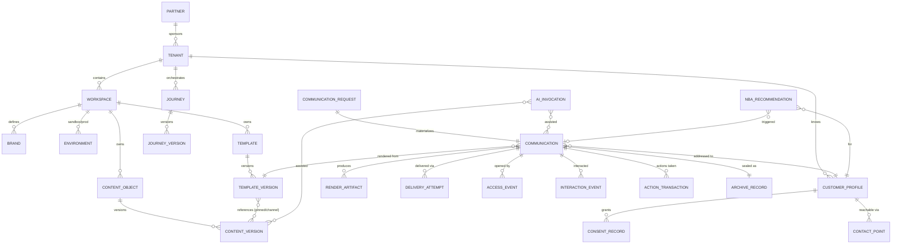
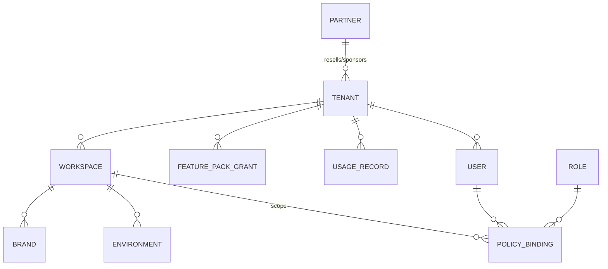
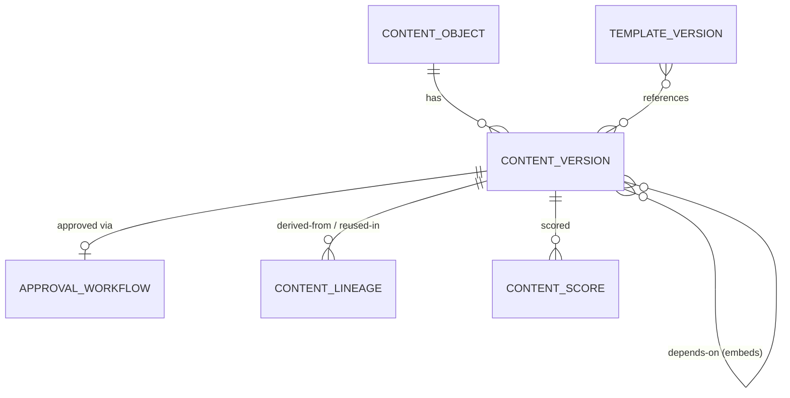
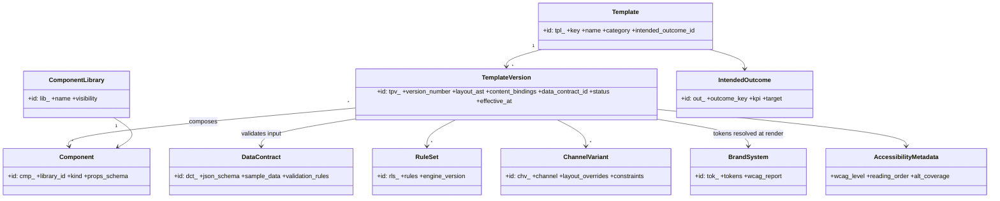
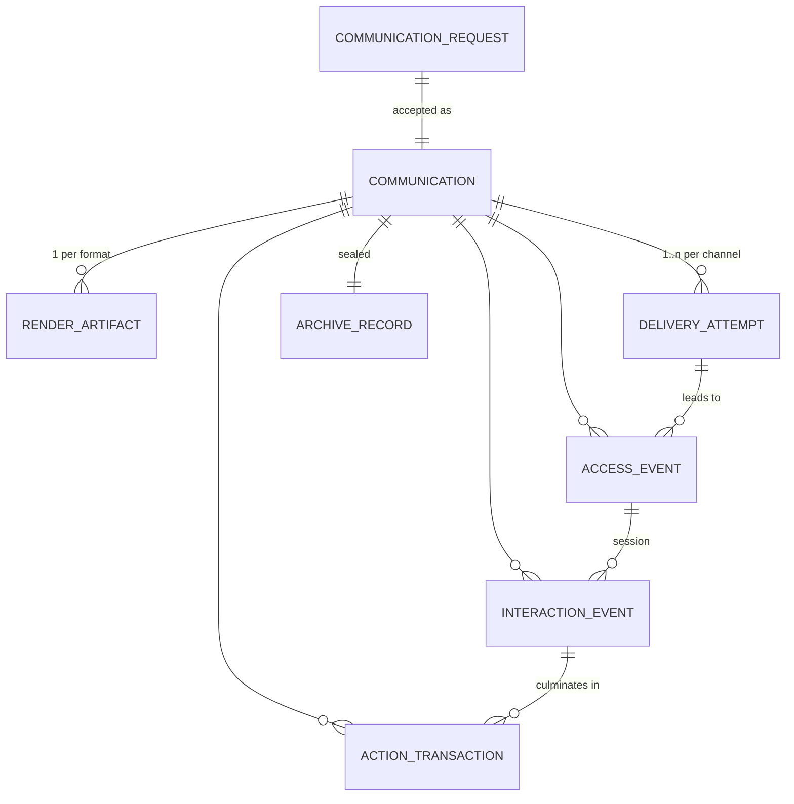
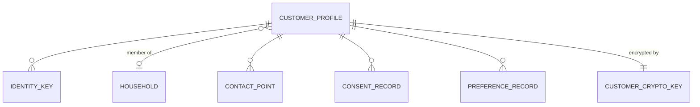
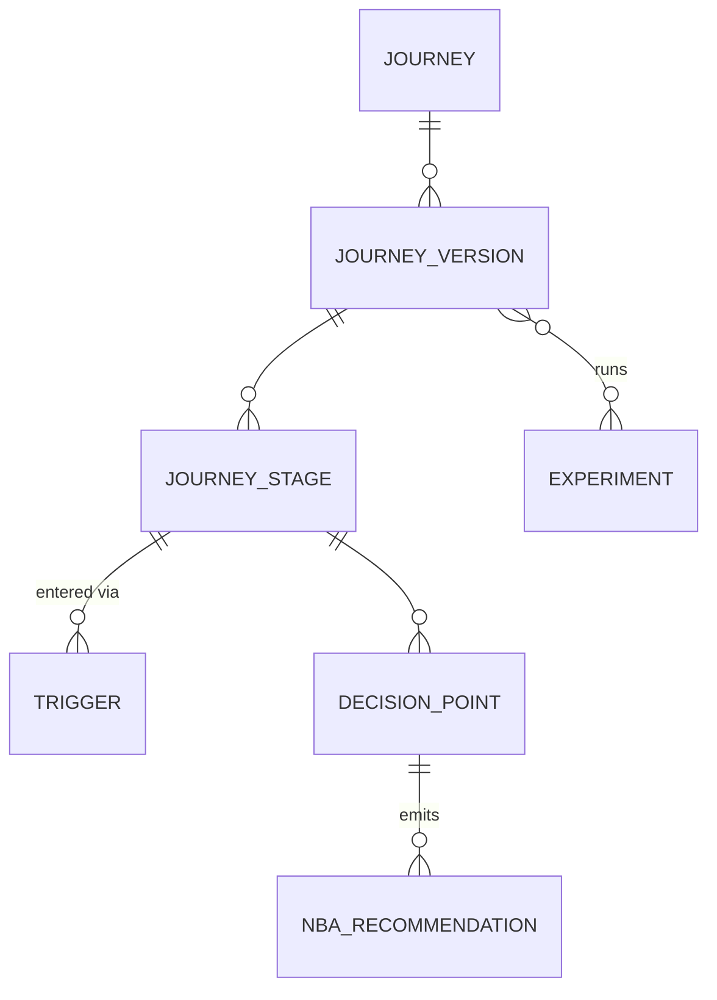
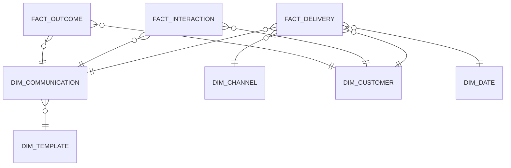

# Acorn Communicate — Data Models

**Document:** `platform/05-data-models.md`
**Status:** Build-ready
**Audience:** Platform engineering, data engineering, DBA/SRE, security & compliance
**Scope:** Logical and physical data models for all bounded contexts of the Acorn Communicate platform (CCM/CXM/IXM/AIXM).

---

## 1. Logical Data Model Overview

### 1.1 Bounded contexts and entity map

The platform is decomposed into ten bounded contexts. Each context owns its entities and exposes them to other contexts only via IDs, published events, or read-model projections — never via cross-context joins at write time.



| Bounded context | Owned aggregates | Section |
|---|---|---|
| Tenancy & Access | Partner, Tenant, Workspace, Brand, Environment, User, Role, PolicyBinding, FeaturePack, UsageRecord | §2 |
| Content | ContentObject, ContentVersion, ApprovalWorkflow, ContentLineage | §3 |
| Template & Design | Template, TemplateVersion, Component, BrandSystem, DataContract, RuleSet, ChannelVariant | §4 |
| Communication Lifecycle | CommunicationRequest, Communication, RenderArtifact, DeliveryAttempt, events | §5 |
| Customer & Identity | CustomerProfile, Household, ConsentRecord, PreferenceRecord, ContactPoint | §6 |
| Journey & Decisioning | Journey, Trigger, DecisionPoint, NBARecommendation, Experiment | §7 |
| AI Platform | PromptTemplate, ModelRoute, AIInvocation, Guardrail, AIAuditRecord | §8 |
| Archive & Records | ArchiveRecord, RetentionPolicy, LegalHold, EvidencePack | §9 |
| Analytics | Canonical events, lakehouse star schema, timelines | §10 |
| Governance | Classification tags, masking, erasure | §12 |

### 1.2 ID conventions — prefixed ULIDs

Every entity ID is a **prefixed ULID**: `{prefix}_{26-char Crockford-base32 ULID}`, e.g. `com_01J9F6ZK3VQ8XN2M4T7RWBHE5D`. ULIDs are time-ordered (48-bit ms timestamp + 80-bit randomness), index-friendly, and the prefix makes every ID self-describing in logs, APIs, and support tickets. IDs are generated by the owning service, never by clients.

| Prefix | Entity | Prefix | Entity | Prefix | Entity |
|---|---|---|---|---|---|
| `prt_` | Partner | `tpl_` | Template | `cus_` | CustomerProfile |
| `ten_` | Tenant | `tpv_` | TemplateVersion | `hh_` | Household |
| `ws_` | Workspace | `cmp_` | Component | `cns_` | ConsentRecord |
| `brd_` | Brand | `lib_` | ComponentLibrary | `prf_` | PreferenceRecord |
| `env_` | Environment | `dct_` | DataContract | `cpt_` | ContactPoint |
| `usr_` | User | `rls_` | RuleSet | `jny_` | Journey |
| `rol_` | Role | `chv_` | ChannelVariant | `jnv_` | JourneyVersion |
| `pol_` | PolicyBinding | `out_` | IntendedOutcome | `stg_` | JourneyStage |
| `fpk_` | FeaturePack | `req_` | CommunicationRequest | `trg_` | Trigger |
| `usg_` | UsageRecord | `com_` | Communication | `dcp_` | DecisionPoint |
| `cnt_` | ContentObject | `ra_` | RenderArtifact | `nba_` | NBARecommendation |
| `cnv_` | ContentVersion | `dlv_` | DeliveryAttempt | `exp_` | Experiment |
| `apw_` | ApprovalWorkflow | `acc_` | AccessEvent | `pmt_` | PromptTemplate |
| `lin_` | ContentLineage edge | `ixe_` | InteractionEvent | `mrt_` | ModelRoute |
| `tok_` | DesignToken set | `act_` | ActionTransaction | `aii_` | AIInvocation |
| `evt_` | Event envelope | `arc_` | ArchiveRecord | `grd_` | Guardrail |
| `ret_` | RetentionPolicy | `hld_` | LegalHold | `aud_` | AIAuditRecord |
| `evp_` | EvidencePack | `key_` | CustomerCryptoKey | `gsr_` | GroundingSource |

### 1.3 Tenancy scoping rule

**Every row in every store carries `tenant_id`** (type `ten_` ULID), including rows already reachable through a tenant-scoped parent. This is non-negotiable: it enables row-level security, partition pruning, per-tenant export/erasure, and safe cross-context joins in the lakehouse.

- **Postgres:** composite primary key `(tenant_id, id)`; every foreign key includes `tenant_id`; RLS policy `USING (tenant_id = current_setting('app.tenant_id')::text)` enforced on all tables; app role has no `BYPASSRLS`.
- **Partition strategy:** high-volume tables (`event_store`, `delivery_attempt`, `interaction_event`, `usage_record`) are **HASH partitioned by `tenant_id` (16–64 partitions)**, then **RANGE sub-partitioned by month** on `occurred_at`. Jumbo tenants (>5% of platform volume) are promoted to dedicated LIST partitions or dedicated databases (cell-based architecture); the routing layer resolves `tenant_id → cell`.
- **Object storage:** key prefix `s3://acorn-{region}-{store}/{tenant_id}/...` so lifecycle, residency, and erasure operate per-prefix.
- **Search/vector indexes:** `tenant_id` is a mandatory filter term injected by the query gateway, never by application code.
- **Environments:** `environment_id` (`env_`) accompanies `tenant_id` on all authoring and runtime rows; sandbox and prod data never share partitions.

---

## 2. Tenant Model



### 2.1 Partner (`prt_`)

| Field | Type | Req | Description |
|---|---|---|---|
| id | ulid(prt_) | Y | Partner ID |
| name | text | Y | Legal/display name |
| kind | enum(`reseller`,`si`,`isv`,`internal`) | Y | Partnership type |
| revenue_share_bps | int | N | Basis points for billing splits |
| status | enum(`active`,`suspended`) | Y | Lifecycle state |
| created_at / updated_at | timestamptz | Y | Audit timestamps (present on all tables; omitted below) |

### 2.2 Tenant (`ten_`)

| Field | Type | Req | Description |
|---|---|---|---|
| id | ulid(ten_) | Y | Tenant ID — the universal scoping key |
| partner_id | ulid(prt_) | N | Sponsoring partner |
| name | text | Y | Customer organization name |
| slug | text | Y | URL-safe unique identifier |
| tier | enum(`starter`,`growth`,`enterprise`,`regulated`) | Y | Drives feature/limit defaults |
| home_region | text | Y | Primary data residency region (e.g. `us-east-1`, `eu-central-1`) |
| allowed_regions | text[] | Y | Regions where this tenant's data may rest |
| cell_id | text | Y | Physical cell assignment for jumbo-tenant routing |
| data_key_arn | text | Y | Tenant master KMS key (envelope encryption root) |
| status | enum(`provisioning`,`active`,`suspended`,`offboarding`) | Y | Lifecycle |

### 2.3 Workspace (`ws_`), Brand (`brd_`), Environment (`env_`)

| Entity | Field | Type | Req | Description |
|---|---|---|---|---|
| Workspace | id | ulid(ws_) | Y | Team/LOB boundary within a tenant (e.g. "Claims", "Cards Marketing") |
| Workspace | tenant_id | ulid(ten_) | Y | Owning tenant |
| Workspace | name, slug | text | Y | Display + URL identity |
| Workspace | default_brand_id | ulid(brd_) | N | Fallback brand |
| Workspace | default_locale | bcp47 | Y | e.g. `en-US` |
| Brand | id | ulid(brd_) | Y | Brand identity (multi-brand tenants: sub-brands, white-label) |
| Brand | workspace_id | ulid(ws_) | Y | Owning workspace |
| Brand | name, logo_uri | text | Y | Identity assets |
| Brand | brand_system_version_id | ulid(tok_) | Y | Active design-token set (§4.4) |
| Brand | sending_domains | jsonb | Y | Verified email/SMS/web domains per channel |
| Environment | id | ulid(env_) | Y | Isolation unit |
| Environment | workspace_id | ulid(ws_) | Y | Owning workspace |
| Environment | kind | enum(`sandbox`,`preprod`,`prod`) | Y | Sandbox data is synthetic-only; promotion is one-way via signed release manifests |
| Environment | pii_allowed | bool | Y | `false` for sandbox — enforced at ingestion |

### 2.4 User (`usr_`), Role (`rol_`), PolicyBinding (`pol_`)

| Entity | Field | Type | Req | Description |
|---|---|---|---|---|
| User | id | ulid(usr_) | Y | Human or service principal |
| User | tenant_id | ulid(ten_) | Y | Home tenant (`ten_platform` for Acorn staff) |
| User | kind | enum(`human`,`service`,`agent`) | Y | `agent` = AI principal acting under delegation |
| User | idp_subject | text | Y | OIDC `iss#sub` — SSO federation key |
| User | email | citext | Y | Login/notification address (PII: `pii.contact`) |
| User | mfa_enrolled | bool | Y | Enforcement flag |
| Role | id | ulid(rol_) | Y | Named permission set |
| Role | key | text | Y | e.g. `content_author`, `template_designer`, `approver_legal`, `journey_operator`, `tenant_admin` |
| Role | permissions | text[] | Y | Actions, e.g. `content:publish`, `template:promote`, `archive:read` |
| Role | is_system | bool | Y | Platform-defined vs tenant-custom |
| PolicyBinding | id | ulid(pol_) | Y | Grant of role to principal at a scope |
| PolicyBinding | principal_id | ulid(usr_) | Y | Who |
| PolicyBinding | role_id | ulid(rol_) | Y | What |
| PolicyBinding | scope_type / scope_id | enum + ulid | Y | `tenant`\|`workspace`\|`brand`\|`environment` + ID — inheritance flows downward |
| PolicyBinding | conditions | jsonb | N | ABAC conditions, e.g. `{"channel": ["email"], "locale_prefix": "en"}` |
| PolicyBinding | expires_at | timestamptz | N | Time-boxed grants (break-glass access) |

### 2.5 FeaturePack (`fpk_`) and UsageRecord (`usg_`)

| Entity | Field | Type | Req | Description |
|---|---|---|---|---|
| FeaturePack | id | ulid(fpk_) | Y | Sellable capability bundle |
| FeaturePack | key | text | Y | e.g. `interactive_docs`, `ai_authoring`, `nba`, `archive_worm` |
| FeaturePack | entitlements | jsonb | Y | Feature flags + hard limits `{"ai_tokens_month": 5e7, "channels": ["email","sms","web"]}` |
| FeaturePackGrant | tenant_id + feature_pack_id | composite | Y | Grant with `starts_at`, `ends_at`, `overrides` jsonb |
| UsageRecord | id | ulid(usg_) | Y | Metered usage line (append-only) |
| UsageRecord | tenant_id / workspace_id / environment_id | ulids | Y | Attribution |
| UsageRecord | meter | enum | Y | `communications_rendered`, `deliveries`, `ai_tokens`, `archive_gb_month`, `api_calls`, `seats` |
| UsageRecord | quantity | numeric | Y | Metered amount |
| UsageRecord | period_start / period_end | timestamptz | Y | Aggregation window (hourly grain) |
| UsageRecord | source_ref | text | N | Idempotency key from the metering pipeline |

---

## 3. Content Model

Content is managed as **immutable versions of typed content objects**, with approval workflows, lineage, scoring, and a dependency graph that powers impact analysis ("what breaks if this clause changes?").



### 3.1 ContentObject (`cnt_`)

| Field | Type | Req | Description |
|---|---|---|---|
| id | ulid(cnt_) | Y | Stable identity across all versions |
| tenant_id / workspace_id | ulids | Y | Scope |
| type | enum(`block`,`clause`,`disclosure`,`image`,`video`,`chart`,`tooltip`,`faq`,`assistant_response`,`translation`) | Y | Content object type; `assistant_response` = curated answer the embedded AI assistant may serve; `translation` links to a source object via lineage |
| key | text | Y | Human-readable unique key within workspace, e.g. `clause.late-fee.v2` |
| name / description | text | Y/N | Authoring metadata |
| owner_user_id | ulid(usr_) | Y | Accountable owner |
| default_locale | bcp47 | Y | Source-of-truth locale |
| status | enum(`active`,`deprecated`,`retired`) | Y | Object-level lifecycle (versions have their own) |
| current_version_id | ulid(cnv_) | N | Latest **published** version (denormalized pointer) |

### 3.2 ContentVersion (`cnv_`) — immutable

Rows are insert-only; the only mutable columns are `status` transitions and `superseded_by`.

| Field | Type | Req | Description |
|---|---|---|---|
| id | ulid(cnv_) | Y | Version ID |
| tenant_id / content_object_id | ulids | Y | Scope + parent |
| version_number | int | Y | Monotonic per object |
| locale | bcp47 | Y | Locale of this version |
| brand_id | ulid(brd_) | N | Null = brand-neutral; set = brand variant of the same semantic version |
| body | jsonb | Y | Structured content (Portable-Text-style AST for text; asset descriptor for media) |
| body_hash | sha256 | Y | Content-addressable hash — dedupe + render-reuse + archive proof |
| asset_uri | text | N | Object-storage URI for binary payloads (image/video) |
| author_user_id | ulid(usr_) | Y | Human author of record (AI-assisted edits still name a human) |
| ai_assisted | bool | Y | True if any AI invocation contributed (see `ai_audit_record`) |
| approval_workflow_id | ulid(apw_) | N | Approval run that published this version |
| status | enum(`draft`,`in_review`,`approved`,`published`,`superseded`,`withdrawn`) | Y | Lifecycle |
| effective_at / expires_at | timestamptz | Y/N | Validity window; renderer refuses expired regulatory content |
| tags | text[] | Y | Curated tags, e.g. `{regulatory, reg-z, fees}` |
| ai_tags | jsonb | Y | Machine-generated tags with confidence: `[{"tag":"apr-disclosure","confidence":0.94,"model":"acorn-tagger-v3"}]` |
| dependencies | ulid(cnv_)[] | Y | Content versions embedded/transcluded by this one (edges also in graph store) |
| superseded_by | ulid(cnv_) | N | Forward pointer set when a newer version publishes |

### 3.3 Scoring attributes (`content_score`)

One row per `(content_version_id, score_kind)`; recomputed scores insert new rows with `scored_at`.

| Field | Type | Req | Description |
|---|---|---|---|
| content_version_id | ulid(cnv_) | Y | Scored version |
| score_kind | enum(`reading_level`,`sentiment`,`brand_score`,`regulatory_risk`,`accessibility`) | Y | Metric family |
| score | numeric | Y | e.g. reading_level = Flesch-Kincaid grade `7.2`; brand_score `0–100`; regulatory_risk `0–1` |
| detail | jsonb | N | Explanations: flagged phrases, tone breakdown, matched-regulation refs |
| scorer / scorer_version | text | Y | Model or rule engine + version, for reproducibility |
| scored_at | timestamptz | Y | When computed |

### 3.4 ApprovalWorkflow (`apw_`)

| Field | Type | Req | Description |
|---|---|---|---|
| id | ulid(apw_) | Y | One approval run per subject version |
| subject_type / subject_id | enum + ulid | Y | `content_version` \| `template_version` \| `prompt_template` |
| workflow_key | text | Y | Definition used, e.g. `legal-2step`, `marketing-fasttrack` |
| stages | jsonb | Y | Ordered stages: `[{"stage":"compliance","required_role":"approver_legal","rule":"any_of"}]` |
| decisions | jsonb | Y | Append-only: `[{"stage":"compliance","user_id":"usr_...","decision":"approved","comment":"...","at":"...","signature":"..."}]` — each decision carries a detached signature for evidence packs |
| status | enum(`pending`,`approved`,`rejected`,`recalled`) | Y | Outcome |
| sla_due_at | timestamptz | N | Escalation trigger |

### 3.5 ContentLineage (`lin_`) — dependency graph & impact analysis

Lineage edges live in Postgres (system of record) and are mirrored into the graph projection used for traversal queries.

| Field | Type | Req | Description |
|---|---|---|---|
| id | ulid(lin_) | Y | Edge ID |
| tenant_id | ulid(ten_) | Y | Scope |
| from_version_id | ulid(cnv_/tpv_) | Y | Source node |
| to_version_id | ulid(cnv_/tpv_) | Y | Target node |
| relation | enum(`derived_from`,`translated_from`,`reused_in`,`embedded_in`,`referenced_by_template`,`generated_from_prompt`) | Y | Edge semantics |
| context | jsonb | N | e.g. `{"slot":"footer_disclosure","channel":"pdf"}` |

**Impact analysis query model:** "publish new version of `cnv_X`" → traverse `embedded_in`/`referenced_by_template` edges (transitively) → return affected TemplateVersions, live Journeys using those templates, and in-flight Communications; classify each as `auto_repin` (channel-latest reference), `requires_review` (pinned reference), or `blocked` (legal hold on template). The traversal result is persisted as an `impact_report` jsonb attached to the approval workflow.

```json
{
  "trigger": {"content_version": "cnv_01J9G0Q2W7...", "replaces": "cnv_01J8ZZY9K1..."},
  "impact": [
    {"template_version": "tpv_01J8XW...", "binding": "pinned", "action": "requires_review",
     "live_journeys": ["jny_01J7Q..."], "monthly_volume": 182000}
  ]
}
```

---

## 4. Template Model



### 4.1 Template (`tpl_`) and TemplateVersion (`tpv_`)

| Entity | Field | Type | Req | Description |
|---|---|---|---|---|
| Template | id | ulid(tpl_) | Y | Stable identity |
| Template | tenant_id / workspace_id | ulids | Y | Scope |
| Template | key / name | text | Y | e.g. `stmt.credit-card.monthly` |
| Template | category | enum(`statement`,`notice`,`letter`,`marketing`,`onboarding`,`claim`,`bill`,`policy_doc`) | Y | Drives defaults (retention class, approval workflow) |
| Template | intended_outcome_id | ulid(out_) | N | §4.6 |
| Template | current_version_id | ulid(tpv_) | N | Latest published |
| TemplateVersion | id | ulid(tpv_) | Y | Immutable version |
| TemplateVersion | template_id / version_number | ulid + int | Y | Parent + monotonic |
| TemplateVersion | layout_ast | jsonb | Y | Channel-neutral layout tree: sections, slots, components, rule hooks |
| TemplateVersion | layout_hash | sha256 | Y | For render-reuse and archive proofs |
| TemplateVersion | content_bindings | jsonb | Y | See binding model below |
| TemplateVersion | data_contract_id | ulid(dct_) | Y | Input schema (§4.3) |
| TemplateVersion | ruleset_ids | ulid(rls_)[] | Y | Conditional/repeat logic (§4.4) |
| TemplateVersion | supported_channels | enum[] | Y | Subset of `{interactive,pdf,email,sms,print,voice,video}` |
| TemplateVersion | approval_workflow_id | ulid(apw_) | N | Publish gate |
| TemplateVersion | status | enum(`draft`,`in_review`,`published`,`superseded`,`withdrawn`) | Y | Lifecycle |
| TemplateVersion | effective_at / expires_at | timestamptz | Y/N | Validity window |
| TemplateVersion | accessibility | jsonb | Y | §4.7 |

**Content binding model** — each slot binds a ContentObject in one of two modes:

```json
{
  "slots": {
    "hero_message":        {"content_object": "cnt_01J8AA...", "mode": "channel_latest", "channel_overrides": {"sms": "cnt_01J8AB..."}},
    "reg_z_disclosure":    {"content_object": "cnt_01J8AC...", "mode": "pinned", "content_version": "cnv_01J8AD..."},
    "faq_panel":           {"content_object": "cnt_01J8AE...", "mode": "channel_latest", "locale_fallback": ["es-US", "en-US"]}
  }
}
```

- `pinned`: the exact ContentVersion is frozen into this TemplateVersion (regulatory text).
- `channel_latest`: resolved at render time to the latest **published, effective** ContentVersion for the target channel/locale/brand; the resolved IDs are captured in the Communication's snapshot for reproducibility.

### 4.2 Component (`cmp_`) and ComponentLibrary (`lib_`)

| Entity | Field | Type | Req | Description |
|---|---|---|---|---|
| ComponentLibrary | id / name | ulid(lib_) + text | Y | Namespace; `visibility` enum(`platform`,`tenant`,`workspace`) |
| Component | id | ulid(cmp_) | Y | Reusable layout unit |
| Component | library_id / key | ulid + text | Y | e.g. `acorn.core/transaction-table` |
| Component | kind | enum(`layout`,`data_table`,`chart`,`action_button`,`assistant_panel`,`form`,`signature`,`payment_widget`,`media`) | Y | Render behavior class |
| Component | props_schema | jsonb (JSON Schema) | Y | Typed props contract |
| Component | channel_renderers | jsonb | Y | Map channel → renderer id + degradation strategy, e.g. chart → PNG for PDF, text summary for SMS/voice |
| Component | version / status | semver + enum | Y | Component versioning is semver; templates pin major versions |

### 4.3 DataContract (`dct_`) — the template's input schema

| Field | Type | Req | Description |
|---|---|---|---|
| id | ulid(dct_) | Y | Contract version (immutable; new contract = new ID) |
| tenant_id / workspace_id | ulids | Y | Scope |
| name / semver | text | Y | e.g. `cc-statement-input@2.1.0` |
| json_schema | jsonb | Y | Draft 2020-12 JSON Schema for the composition payload |
| field_annotations | jsonb | Y | Per-field: PII class, masking rule, source system, description |
| sample_data | jsonb | Y | Valid example used by designer preview, tests, sandbox |
| validation_rules | jsonb | Y | Cross-field rules beyond schema: `[{"rule":"sum(transactions[].amount) == totals.purchases","severity":"reject"}]` |
| compatibility | enum(`backward`,`forward`,`full`,`none`) | Y | Evolution policy enforced by the schema registry |

```json
{
  "id": "dct_01J8QR5T...",
  "name": "cc-statement-input", "semver": "2.1.0",
  "json_schema": {
    "type": "object",
    "required": ["account", "period", "totals", "transactions"],
    "properties": {
      "account":      {"type": "object", "properties": {"last4": {"type": "string", "pattern": "^\\d{4}$"}}},
      "period":       {"type": "object", "properties": {"start": {"type": "string", "format": "date"}, "end": {"type": "string", "format": "date"}}},
      "totals":       {"type": "object", "properties": {"balance": {"type": "number"}, "min_due": {"type": "number"}, "due_date": {"type": "string", "format": "date"}}},
      "transactions": {"type": "array", "items": {"$ref": "#/$defs/txn"}, "maxItems": 5000}
    }
  },
  "field_annotations": {
    "account.last4": {"pii": "pii.financial.masked", "source": "core-banking"},
    "totals.balance": {"pii": "pii.financial", "mask": "none_in_render"}
  }
}
```

### 4.4 RuleSet (`rls_`) and BrandSystem/DesignToken (`tok_`)

| Entity | Field | Type | Req | Description |
|---|---|---|---|---|
| RuleSet | id | ulid(rls_) | Y | Immutable rule bundle |
| RuleSet | engine / engine_version | text | Y | `json-logic@2` or `cel@0.20` — pinned for reproducibility |
| RuleSet | rules | jsonb | Y | `[{"id":"r1","kind":"conditional_slot","slot":"late_fee_notice","when":{"<":[{"var":"totals.paid"},{"var":"totals.min_due"}]}}, {"id":"r2","kind":"repeat","slot":"txn_row","over":"transactions","sort":"posted_at"}]` |
| BrandSystem | id | ulid(tok_) | Y | Versioned design-token set per Brand |
| BrandSystem | brand_id / semver | ulid + text | Y | Parent + version |
| BrandSystem | tokens | jsonb | Y | W3C design-tokens format: color, type scale, spacing, logo slots, channel themes (email-safe palette, print CMYK, PDF fonts) |
| BrandSystem | wcag_report | jsonb | Y | Contrast-pair validation results computed at publish |

### 4.5 ChannelVariant (`chv_`)

| Field | Type | Req | Description |
|---|---|---|---|
| id | ulid(chv_) | Y | Variant row |
| template_version_id | ulid(tpv_) | Y | Parent |
| channel | enum(`interactive`,`pdf`,`email`,`sms`,`print`,`voice`,`video`) | Y | Target |
| layout_overrides | jsonb | Y | Channel-specific AST patches (e.g. SMS: 3-message thread with link; print: duplex + OMR marks) |
| constraints | jsonb | Y | `{"sms":{"max_segments":3},"email":{"max_kb":102},"print":{"paper":"letter","duplex":true,"mail_class":"first"}}` |
| renderer / renderer_version | text | Y | Pinned render engine (`acorn-render-html@4.2.1`, `acorn-render-pdf@3.8.0`) |
| status | enum(`enabled`,`disabled`) | Y | Per-channel kill switch |

### 4.6 IntendedOutcome (`out_`)

| Field | Type | Req | Description |
|---|---|---|---|
| id | ulid(out_) | Y | Declared purpose of the communication |
| outcome_key | text | Y | e.g. `payment_completed`, `document_signed`, `dispute_resolved`, `paperless_enrolled`, `informed_only` |
| kpi | jsonb | Y | `{"metric":"action_completion_rate","event":"action.completed","action_type":"payment","window_days":14}` |
| target | numeric | N | Goal value, e.g. `0.35` |
| deflection_intent | bool | Y | Whether success includes *not* generating a call — links to call-deflection metric |

### 4.7 AccessibilityMetadata (embedded jsonb on TemplateVersion)

| Field | Type | Req | Description |
|---|---|---|---|
| wcag_level | enum(`A`,`AA`,`AAA`) | Y | Certified level for interactive/HTML output |
| pdf_ua | bool | Y | PDF/UA-1 compliance for PDF variant |
| reading_order | jsonb | Y | Explicit tag order for screen readers |
| alt_coverage | numeric | Y | Fraction of media slots with alt text (publish gate ≥ 1.0) |
| language_tagging | bool | Y | Per-slot `lang` attributes emitted |
| large_print / braille_ready | bool | Y | Print accessibility variants available |

---

## 5. Communication Lifecycle Model (Event-Sourced)

The Communication context is **event-sourced**: the event stream is the system of record; all state tables are projections. This yields a complete, replayable audit trail — the foundation for evidence packs (§9).

### 5.1 Lifecycle flow



### 5.2 CommunicationRequest (`req_`)

| Field | Type | Req | Description |
|---|---|---|---|
| id | ulid(req_) | Y | Intake record (API call, batch row, or journey step) |
| tenant_id / workspace_id / environment_id | ulids | Y | Scope |
| idempotency_key | text | Y | Caller-supplied; unique per tenant — duplicate requests return the original Communication |
| template_key_or_id | text | Y | Template reference; version resolved at acceptance unless pinned |
| customer_ref | jsonb | Y | Identity keys used to resolve `cus_` (e.g. `{"tenant_customer_id":"ACCT-994412"}`) |
| payload | jsonb | Y | Composition data — validated against the DataContract; rejected requests keep the validation report |
| channel_plan | jsonb | N | Requested channels/priorities; null = preference-driven (§6) |
| journey_context | jsonb | N | `{"journey_id":"jny_...","journey_version":"jnv_...","stage_id":"stg_...","run_id":"..."}` |
| source | enum(`api`,`batch`,`journey`,`agent_desktop`,`event_trigger`) | Y | Origin |
| status | enum(`received`,`validated`,`rejected`,`accepted`) | Y | Intake outcome |
| validation_report | jsonb | N | Schema + rule violations when rejected |

### 5.3 Communication (`com_`) — the aggregate root

| Field | Type | Req | Description |
|---|---|---|---|
| id | ulid(com_) | Y | Aggregate ID; also the event-stream partition key |
| tenant_id / workspace_id / environment_id / brand_id | ulids | Y | Scope |
| request_id | ulid(req_) | Y | Provenance |
| customer_id | ulid(cus_) | Y | Resolved recipient |
| template_version_id | ulid(tpv_) | Y | Exact version rendered |
| resolved_content_versions | jsonb | Y | Map slot → `cnv_` resolved at compose time (freezes `channel_latest` bindings) |
| data_snapshot_uri | text | Y | Object-storage URI of the exact composition payload (encrypted with customer DEK, §12) |
| data_snapshot_hash | sha256 | Y | Hash of canonicalized payload — reproduction proof |
| journey_context | jsonb | N | Copied from request |
| intended_outcome_id | ulid(out_) | N | Denormalized from template |
| locale / timezone | bcp47 + tz | Y | Resolved presentation context |
| status | enum(`composed`,`rendering`,`rendered`,`delivering`,`delivered`,`partially_delivered`,`failed`,`viewed`,`actioned`,`outcome_met`,`archived`) | Y | **Projection** — derived from events, never written directly |
| outcome_met_at | timestamptz | N | Projection: intended-outcome KPI satisfied |

### 5.4 RenderArtifact (`ra_`)

| Field | Type | Req | Description |
|---|---|---|---|
| id | ulid(ra_) | Y | One per (communication, format) |
| communication_id | ulid(com_) | Y | Parent |
| format | enum(`html5_interactive`,`pdf`,`pdf_a3`,`email_mime`,`sms_text`,`afp`,`zpl`,`ssml`,`video_manifest`) | Y | Output format; `pdf_a3` embeds the data snapshot for archive |
| content_hash | sha256 | Y | Hash of rendered bytes |
| storage_uri | text | Y | `s3://acorn-{region}-artifacts/{tenant_id}/{com_id}/{format}` |
| size_bytes | bigint | Y | Artifact size |
| render_reuse_key | sha256 | Y | `hash(template_version ‖ resolved_content_versions ‖ data_snapshot_hash ‖ renderer_version ‖ format ‖ brand_tokens_version)` — identical keys skip re-render and reuse the artifact (batch statements with shared pages reuse at page-fragment level too) |
| renderer / renderer_version | text | Y | Engine provenance |
| render_ms | int | Y | Latency |
| accessibility_report | jsonb | N | Post-render WCAG/PDF-UA validation |

### 5.5 DeliveryAttempt (`dlv_`)

| Field | Type | Req | Description |
|---|---|---|---|
| id | ulid(dlv_) | Y | One per attempt (retries = new rows) |
| communication_id / render_artifact_id | ulids | Y | What was sent |
| attempt_number | int | Y | 1..n per channel |
| channel | enum(`email`,`sms`,`push`,`web_portal`,`print_mail`,`voice`,`whatsapp`,`rcs`) | Y | Delivery channel |
| provider / provider_message_id | text | Y/N | e.g. `ses`, `twilio`, `lob`; provider's tracking ID |
| contact_point_id | ulid(cpt_) | Y | Address used (frozen copy in `address_used` jsonb) |
| consent_record_id | ulid(cns_) | Y | Consent that authorized this send — evidence-pack requirement |
| status | enum(`queued`,`sent`,`delivered`,`bounced`,`deferred`,`failed`,`suppressed`,`returned_mail`) | Y | Current provider status |
| status_detail | jsonb | Y | Provider receipts, SMTP codes, USPS scan events — raw evidence |
| queued_at / sent_at / delivered_at | timestamptz | Y/N/N | Timing |
| cost_micros / cost_currency | bigint + char(3) | N | Unit economics |

### 5.6 AccessEvent (`acc_`), InteractionEvent (`ixe_`), ActionTransaction (`act_`)

| Entity | Field | Type | Req | Description |
|---|---|---|---|---|
| AccessEvent | id | ulid(acc_) | Y | Recipient opened/authenticated to the communication |
| AccessEvent | communication_id / delivery_attempt_id | ulids | Y/N | Link to send (null for portal pull) |
| AccessEvent | auth_method | enum(`magic_link`,`otp_sms`,`otp_email`,`portal_sso`,`kba`,`none_public`) | Y | How identity was asserted |
| AccessEvent | auth_strength | enum(`anonymous`,`possession`,`verified_identity`) | Y | Gate for sensitive sections/actions |
| AccessEvent | ip / ip_geo | inet + jsonb | Y | Network evidence (PII: `pii.network`) |
| AccessEvent | device | jsonb | Y | UA, device class, OS, screen — parsed, not raw fingerprint |
| AccessEvent | session_id | ulid | Y | Groups subsequent interaction events |
| InteractionEvent | id | ulid(ixe_) | Y | Fine-grained engagement inside interactive doc |
| InteractionEvent | communication_id / session_id | ulids | Y | Scope |
| InteractionEvent | kind | enum(`section_view`,`scroll_depth`,`expand`,`tooltip_open`,`faq_open`,`chart_interact`,`action_started`,`action_step`,`action_completed`,`action_abandoned`,`assistant_question`,`assistant_answer_viewed`,`download`,`share`) | Y | Event type |
| InteractionEvent | target | jsonb | Y | `{"section":"fees","component":"cmp_...","scroll_pct":75}` |
| InteractionEvent | assistant_ref | ulid(aii_) | N | For assistant Q&A: the AIInvocation that produced the answer |
| InteractionEvent | occurred_at | timestamptz(ms) | Y | Client time reconciled to server clock |
| ActionTransaction | id | ulid(act_) | Y | A completed (or attempted) embedded action |
| ActionTransaction | communication_id / session_id / access_event_id | ulids | Y | Provenance chain: who, via which authenticated session |
| ActionTransaction | action_type | enum(`payment`,`dispute`,`claim_submission`,`form_submission`,`signature`,`appointment`,`preference_update`,`paperless_optin`,`document_upload`) | Y | Business action |
| ActionTransaction | payload | jsonb | Y | Submitted data (encrypted with customer DEK; PII/PCI-scoped) |
| ActionTransaction | external_system / external_ref | text | Y | System of record integration: `stripe:pi_3Nk...`, `guidewire:CLM-99213`, `docusign:env-...` |
| ActionTransaction | status | enum(`initiated`,`pending_external`,`completed`,`failed`,`reversed`) | Y | Saga state with the external system |
| ActionTransaction | idempotency_key | text | Y | Prevents double-submit (double payment) |
| ActionTransaction | amount_micros / currency | bigint + char(3) | N | For monetary actions |

### 5.7 Event stream

All lifecycle facts are appended to the `event_store` table (Postgres, partitioned per §1.3) and published to the event bus. Envelope: CloudEvents 1.0 (§10.1). Stream key = `communication_id`; `sequence` is per-stream monotonic with optimistic concurrency.

| event_type | Payload schema (registry key) | Producer |
|---|---|---|
| `communication.requested` | `req.v2` — request snapshot, idempotency key | Intake API / Batch ingester |
| `communication.request_rejected` | `reqrej.v1` — validation report | Intake API |
| `communication.composed` | `comp.v3` — template_version, resolved content versions, data_snapshot_hash, customer_id | Composition service |
| `render.started` / `render.completed` / `render.failed` | `rnd.v2` — format, content_hash, storage_uri, render_reuse_key, reused:boolean | Render orchestrator |
| `delivery.queued` / `delivery.sent` | `dlv.v3` — channel, provider, contact_point, consent_record_id | Delivery service |
| `delivery.delivered` / `delivery.bounced` / `delivery.failed` | `dlvstat.v3` — provider receipt payload | Provider webhook normalizer |
| `delivery.suppressed` | `sup.v1` — suppression reason (consent, quiet hours, legal) | Delivery policy engine |
| `access.granted` / `access.denied` | `acc.v2` — auth method/strength, ip, device | Interactive doc gateway |
| `interaction.recorded` | `ixe.v4` — kind, target, session (batched, 1 event per client flush) | Interactive doc runtime |
| `assistant.exchanged` | `ast.v2` — question hash, aii_ ref, grounding refs | Embedded assistant service |
| `action.initiated` / `action.completed` / `action.failed` | `act.v3` — action_type, external_ref, amount | Action orchestrator |
| `outcome.evaluated` | `out.v1` — intended_outcome_id, met:boolean, evidence event refs | Outcome evaluator (scheduled) |
| `archive.sealed` | `arc.v2` — archive_record_id, worm_uri, manifest hash | Archiver |
| `communication.erased` | `ers.v1` — crypto-shred proof, fields nulled (§12) | Privacy service |

```json
{
  "specversion": "1.0",
  "id": "evt_01J9H2M8PW5K3QZX7C1VNBTR4E",
  "type": "com.acorn.delivery.delivered.v3",
  "source": "/delivery/webhook-normalizer",
  "subject": "com_01J9H2KRTF8Y6W3N0QZXVMB94A",
  "time": "2026-07-06T14:22:31.204Z",
  "tenantid": "ten_01J5R8...", "environmentid": "env_01J5R9...",
  "sequence": 14,
  "dataschema": "registry://dlvstat.v3",
  "data": {
    "delivery_attempt_id": "dlv_01J9H2...",
    "channel": "email", "provider": "ses",
    "provider_receipt": {"messageId": "0100018...", "smtpResponse": "250 2.6.0 OK"},
    "delivered_at": "2026-07-06T14:22:30.911Z"
  }
}
```

### 5.8 CQRS read models (projections)

Projectors are idempotent consumers of the event stream; each maintains a versioned checkpoint (`projector_name, partition, last_sequence`). Rebuild = truncate + replay.

| Projection | Store | Built from | Serves |
|---|---|---|---|
| `communication_current` | Postgres | All `communication.*`, `render.*`, `delivery.*`, `outcome.*` | Status API, operator console — one row per Communication with latest status, channel matrix, outcome flag |
| `delivery_status_by_channel` | Postgres | `delivery.*` | Retry scheduler, suppression checks |
| `customer_timeline` | Document DB | All events keyed by `customer_id` | Agent desktop, portal "my documents", §10.5 |
| `engagement_rollup` | Postgres (hourly upsert) | `access.*`, `interaction.*` | Template analytics dashboard |
| `outcome_funnel` | Lakehouse (streaming) | Full stream | §10 star schema facts |
| `search_index` | OpenSearch | `communication.composed`, `archive.sealed` | Full-metadata communication search |

---

## 6. Customer & Identity Model



### 6.1 CustomerProfile (`cus_`) and IdentityKeys

| Entity | Field | Type | Req | Description |
|---|---|---|---|---|
| CustomerProfile | id | ulid(cus_) | Y | Platform-internal identity; never exposed to end customers |
| CustomerProfile | tenant_id | ulid(ten_) | Y | Customers are tenant-scoped; no cross-tenant identity resolution |
| CustomerProfile | kind | enum(`person`,`business`) | Y | B2C vs B2B recipient |
| CustomerProfile | display_name | text(enc) | Y | Encrypted with customer DEK (§12) |
| CustomerProfile | locale / timezone | bcp47 + tz | Y | Presentation defaults |
| CustomerProfile | crypto_key_id | ulid(key_) | Y | Per-customer DEK reference — the crypto-shredding anchor |
| CustomerProfile | status | enum(`active`,`merged`,`erased`) | Y | `merged` rows carry `merged_into_id` |
| IdentityKey | customer_id | ulid(cus_) | Y | Parent |
| IdentityKey | key_type | enum(`tenant_customer_id`,`account_number`,`email`,`phone`,`address_hash`,`external_crm_id`) | Y | Resolution key kind |
| IdentityKey | key_value_hash | sha256(hmac) | Y | HMAC(tenant pepper, normalized value) — used for matching without storing raw value in the index |
| IdentityKey | key_value_enc | bytea | N | Raw value encrypted with customer DEK (for display/use) |
| IdentityKey | confidence / source | numeric + text | Y | 1.0 for tenant-asserted; <1.0 for probabilistic matches |
| Household | id | ulid(hh_) | Y | Grouping for household-level suppression, statement consolidation |
| Household | member roles | jsonb | Y | `[{"customer_id":"cus_...","role":"primary"}]` |

### 6.2 ConsentRecord (`cns_`) — append-only

| Field | Type | Req | Description |
|---|---|---|---|
| id | ulid(cns_) | Y | One row per consent state change; current state = latest per (channel,purpose) |
| customer_id / tenant_id | ulids | Y | Scope |
| channel | enum(`email`,`sms`,`push`,`voice`,`print_mail`,`whatsapp`,`web_tracking`) | Y | Channel consented |
| purpose | enum(`transactional`,`regulatory`,`marketing`,`research`,`ai_personalization`) | Y | Purpose limitation key |
| status | enum(`granted`,`revoked`,`expired`) | Y | State asserted by this record |
| granted_at / effective_until | timestamptz | Y/N | Timing; regulatory purpose never expires while relationship active |
| source | enum(`web_form`,`ivr`,`paper`,`api_import`,`interactive_doc`,`agent`) | Y | Capture point |
| proof | jsonb | Y | Evidence: form snapshot hash, IVR recording URI, double-opt-in message IDs, signature ref |
| legal_basis | enum(`consent`,`contract`,`legal_obligation`,`legitimate_interest`) | Y | GDPR basis |

### 6.3 PreferenceRecord (`prf_`) and ContactPoint (`cpt_`)

| Entity | Field | Type | Req | Description |
|---|---|---|---|---|
| PreferenceRecord | customer_id | ulid(cus_) | Y | Parent (one active row per scope) |
| PreferenceRecord | scope | enum(`global`,`category`,`template`) + ref | Y | Preference granularity |
| PreferenceRecord | channel_priority | jsonb | Y | Ordered: `["push","email","sms","print_mail"]` — delivery planner walks this list |
| PreferenceRecord | language | bcp47 | N | Overrides profile locale |
| PreferenceRecord | quiet_hours | jsonb | N | `{"tz":"America/Chicago","windows":[{"from":"21:00","to":"08:00"}]}` — non-urgent sends held |
| PreferenceRecord | paperless | bool | Y | Suppresses print when a digital channel succeeds; regulatory fallback to print on digital failure |
| PreferenceRecord | frequency_caps | jsonb | N | `{"marketing":{"max_per_week":2}}` |
| ContactPoint | id | ulid(cpt_) | Y | Deliverable address |
| ContactPoint | customer_id / channel | ulid + enum | Y | Owner + channel |
| ContactPoint | value_enc / value_hash | bytea + sha256 | Y | Encrypted raw + HMAC for dedupe/suppression lists |
| ContactPoint | verification_status | enum(`unverified`,`pending`,`verified`,`failed`,`bounced_hard`) | Y | Gate: regulatory sends require ≥`verified` or documented fallback |
| ContactPoint | verified_at / verification_method | timestamptz + enum(`otp`,`double_optin`,`delivery_confirmed`,`tenant_asserted`) | N | Proof of verification |
| ContactPoint | is_primary | bool | Y | Per channel |
| ContactPoint | postal_standardization | jsonb | N | For `print_mail`: CASS results — `{"zip4":"78701-3218","dpv":"Y","dpv_footnotes":["AA","BB"],"carrier_route":"C012","standardized":{...},"cass_cycle":"O","validated_at":"..."}` |
| ContactPoint | ncoa_move | jsonb | N | NCOA move-update result with new address ref |

---

## 7. Journey & NBA Model



### 7.1 Journey (`jny_`), JourneyVersion (`jnv_`), JourneyStage (`stg_`)

| Entity | Field | Type | Req | Description |
|---|---|---|---|---|
| Journey | id / key / name | ulid(jny_) + text | Y | e.g. `journey.card-onboarding` |
| Journey | tenant_id / workspace_id | ulids | Y | Scope |
| JourneyVersion | id | ulid(jnv_) | Y | Immutable published definition |
| JourneyVersion | graph | jsonb | Y | DAG of stages, transitions, wait states, exit criteria |
| JourneyVersion | entry_criteria | jsonb | Y | Segment/eligibility rules |
| JourneyVersion | goal_outcome_id | ulid(out_) | N | Journey-level KPI |
| JourneyVersion | status | enum(`draft`,`published`,`paused`,`retired`) | Y | Running instances pin their version |
| JourneyStage | id / journey_version_id | ulids | Y | Node in the DAG |
| JourneyStage | kind | enum(`send_communication`,`wait`,`decision`,`nba`,`split_experiment`,`webhook`,`update_profile`,`exit`) | Y | Stage behavior |
| JourneyStage | config | jsonb | Y | e.g. send stage: `{"template":"tpl_...","channel_plan":"preference_driven"}` |

### 7.2 Trigger (`trg_`) and DecisionPoint (`dcp_`)

| Entity | Field | Type | Req | Description |
|---|---|---|---|---|
| Trigger | id | ulid(trg_) | Y | Journey/stage entry condition |
| Trigger | kind | enum(`event`,`schedule`,`segment_entry`,`api`,`communication_event`) | Y | `communication_event` lets journeys react to `interaction.recorded`/`action.completed` |
| Trigger | spec | jsonb | Y | Event filter (`{"type":"action.completed","match":{"action_type":"payment"}}`) or cron |
| Trigger | dedupe_window | interval | N | Re-entry suppression |
| DecisionPoint | id | ulid(dcp_) | Y | Branching node |
| DecisionPoint | mode | enum(`rules`,`model`,`nba_hybrid`) | Y | Deterministic rules, ML model, or NBA arbitration |
| DecisionPoint | ruleset_id / model_route_id | ulid(rls_)/ulid(mrt_) | N | Logic reference by mode |
| DecisionPoint | fallback_branch | text | Y | Branch taken on model timeout/error — always deterministic |

### 7.3 NextBestActionRecommendation (`nba_`) — full decision provenance

| Field | Type | Req | Description |
|---|---|---|---|
| id | ulid(nba_) | Y | One row per decision rendered |
| tenant_id / customer_id | ulids | Y | Scope + subject |
| decision_point_id / journey_context | ulid + jsonb | N | Where decided (null for on-demand NBA API) |
| inputs_snapshot_uri / inputs_hash | text + sha256 | Y | Frozen feature vector + eligibility inputs (customer-DEK encrypted) — reproducibility |
| candidates | jsonb | Y | Scored actions considered: `[{"action":"offer_payment_plan","score":0.81,"eligible":true},{"action":"send_reminder","score":0.55}]` |
| model_id / model_version / rules_version | text | Y | Exact decisioning versions |
| explanation | jsonb | Y | Top features/reason codes: `[{"feature":"days_past_due","contribution":0.34}]` — customer-safe reason string included |
| chosen_action | text | Y | Winner after guardrails/arbitration |
| guardrails_applied | jsonb | Y | Suppressions applied (frequency cap, consent, fairness constraint) |
| experiment_id / variant | ulid(exp_) + text | N | If decision was under experiment |
| decided_at / expires_at | timestamptz | Y | Validity of recommendation |
| outcome | jsonb | N | Written back by outcome evaluator: `{"acted":true,"event":"act_01J9...","observed_at":"..."}` — training label |

### 7.4 Experiment (`exp_`)

| Field | Type | Req | Description |
|---|---|---|---|
| id | ulid(exp_) | Y | A/B or multivariate test |
| tenant_id / workspace_id | ulids | Y | Scope |
| subject_type | enum(`template_version`,`content_version`,`journey_branch`,`nba_policy`,`send_time`) | Y | What varies |
| variants | jsonb | Y | `[{"key":"control","ref":"tpv_A","allocation":0.5},{"key":"treatment","ref":"tpv_B","allocation":0.5}]` |
| allocation_unit | enum(`customer`,`communication`,`household`) | Y | Randomization unit (hash of unit ID + experiment salt) |
| primary_metric / guardrail_metrics | jsonb | Y | Metric keys from §10.4 + minimum-detectable-effect config |
| status | enum(`draft`,`running`,`stopped`,`concluded`) | Y | Lifecycle |
| conclusion | jsonb | N | Winner, lift, confidence interval, decision log |

---

## 8. AI Model

Every AI touchpoint is recorded: prompts are versioned and approved like content; every invocation is costed, graded, and linked to what it changed.

### 8.1 PromptTemplate (`pmt_`) and ModelRoute (`mrt_`)

| Entity | Field | Type | Req | Description |
|---|---|---|---|---|
| PromptTemplate | id | ulid(pmt_) | Y | Immutable prompt version |
| PromptTemplate | key / version_number | text + int | Y | e.g. `assistant.doc-qa`, `authoring.tone-rewrite` |
| PromptTemplate | body | text | Y | Prompt with typed placeholders |
| PromptTemplate | variables_schema | jsonb | Y | JSON Schema for placeholder values |
| PromptTemplate | approval_workflow_id | ulid(apw_) | N | Prompts serving regulated tenants require approval |
| PromptTemplate | status | enum(`draft`,`approved`,`published`,`retired`) | Y | Lifecycle |
| ModelRoute | id | ulid(mrt_) | Y | Task → model tier mapping (tenant-overridable) |
| ModelRoute | task | enum(`doc_qa`,`summarize`,`tone_rewrite`,`translate`,`tagging`,`scoring`,`nba_ranking`,`data_extraction`) | Y | Workload class |
| ModelRoute | tier_chain | jsonb | Y | Ordered fallback: `[{"model":"model-large-4","max_latency_ms":4000},{"model":"model-small-2"}]` |
| ModelRoute | constraints | jsonb | Y | `{"region_pin":"eu","max_cost_micros_per_call":900,"pii_allowed":false}` |

### 8.2 AIInvocation (`aii_`)

| Field | Type | Req | Description |
|---|---|---|---|
| id | ulid(aii_) | Y | One row per model call |
| tenant_id / environment_id | ulids | Y | Scope + metering attribution |
| task / model_route_id | enum + ulid | Y | Workload + route used |
| prompt_template_id | ulid(pmt_) | Y | Version used |
| prompt_hash | sha256 | Y | Hash of fully-rendered prompt (raw prompt stored only if tenant opts into debug retention, customer-DEK encrypted when it contains PII) |
| model / model_version | text | Y | Exact model identifier |
| input_tokens / output_tokens | int | Y | Usage |
| latency_ms / cost_micros | int + bigint | Y | Performance + unit economics |
| confidence | numeric | N | Model/verifier-reported confidence 0–1 |
| citations | jsonb | N | Grounding refs: `[{"grounding_source":"gsr_...","span":"cnv_01J8...#sec2","score":0.92}]` |
| guardrail_results | jsonb | Y | Per-guardrail pass/fail with matched rules |
| human_review_status | enum(`not_required`,`pending`,`approved`,`rejected`,`edited`) | Y | Human-in-the-loop disposition |
| reviewed_by / reviewed_at | ulid(usr_) + timestamptz | N | Reviewer of record |
| context_ref | jsonb | N | Where invoked: `{"communication_id":"com_...","session_id":"..."}` |

### 8.3 GroundingSource (`gsr_`) and Guardrail (`grd_`)

| Entity | Field | Type | Req | Description |
|---|---|---|---|---|
| GroundingSource | id | ulid(gsr_) | Y | Retrieval corpus entry |
| GroundingSource | source_type | enum(`content_version`,`template_doc`,`knowledge_article`,`data_snapshot_field`,`tenant_policy_doc`) | Y | The assistant may ONLY ground on these — no open-web |
| GroundingSource | source_ref / chunk_ref | text | Y | e.g. `cnv_01J8...#chunk3` |
| GroundingSource | embedding_ref | text | Y | Vector-DB point ID; embeddings carry `tenant_id` filter payload |
| GroundingSource | freshness_at | timestamptz | Y | Re-embed trigger on new content versions |
| Guardrail | id | ulid(grd_) | Y | Policy applied pre/post invocation |
| Guardrail | kind | enum(`pii_egress_block`,`topic_fence`,`grounding_required`,`toxicity`,`brand_tone`,`regulatory_claim_block`,`confidence_floor`,`human_review_gate`) | Y | Check type |
| Guardrail | config | jsonb | Y | Thresholds, blocked topics, required-citation count |
| Guardrail | scope | jsonb | Y | Tasks/tenants/environments it binds to |
| Guardrail | on_fail | enum(`block`,`fallback_response`,`route_to_human`,`degrade_model`) | Y | Enforcement action |

### 8.4 AIAuditRecord (`aud_`)

The join that makes every AI-assisted change accountable — required for regulated tenants' evidence packs.

| Field | Type | Req | Description |
|---|---|---|---|
| id | ulid(aud_) | Y | Audit link row |
| tenant_id | ulid(ten_) | Y | Scope |
| ai_invocation_id | ulid(aii_) | Y | The model call |
| affected_type | enum(`content_version`,`template_version`,`communication`,`nba_recommendation`,`customer_profile`) | Y | What was touched |
| affected_id | ulid | Y | The touched entity |
| change_kind | enum(`generated`,`rewrote`,`translated`,`suggested_accepted`,`suggested_rejected`,`answered_question`,`scored`,`decided`) | Y | Nature of AI involvement |
| diff_uri | text | N | Object-storage URI of before/after diff |
| human_actor | ulid(usr_) | N | Human who accepted/edited (null for fully-automated flows, which must be covered by an approved automation policy ref) |
| automation_policy_ref | text | N | Policy authorizing autonomous change |

---

## 9. Archive & Records Model

### 9.1 ArchiveRecord (`arc_`) — immutable, reproducible

| Field | Type | Req | Description |
|---|---|---|---|
| id | ulid(arc_) | Y | One per archived Communication (plus per-artifact children) |
| tenant_id / communication_id | ulids | Y | Scope + subject |
| worm_uri | text | Y | Object-lock (compliance-mode) URI of the sealed bundle — no delete/overwrite until retention expiry |
| bundle_hash | sha256 | Y | Hash of the sealed bundle; anchored in the chain-of-custody log |
| reproduction_manifest | jsonb | Y | Everything needed to reproduce the communication bit-for-bit (below) |
| retention_class | text (FK retention_policy.class) | Y | e.g. `reg-7y`, `marketing-13m` |
| retention_expires_at | timestamptz | Y | Computed at seal; extended by legal holds |
| legal_hold_ids | ulid(hld_)[] | Y | Active holds (empty array normally) |
| sealed_at / sealed_by | timestamptz + text | Y | Archiver service version |
| erasure_state | enum(`intact`,`crypto_shredded`) | Y | §12 — WORM bundle remains, customer-DEK-encrypted fields unreadable |

```json
{
  "reproduction_manifest": {
    "communication_id": "com_01J9H2KRTF...",
    "template_version_id": "tpv_01J8XW...", "layout_hash": "sha256:9f2a...",
    "content_versions": {"hero_message": "cnv_01J8AA...", "reg_z_disclosure": "cnv_01J8AD..."},
    "data_snapshot": {"uri": "s3://acorn-us-archive/ten_.../com_.../snapshot.enc", "hash": "sha256:41bc...", "dek_key_id": "key_01J6..."},
    "render_engine": {"name": "acorn-render-pdf", "version": "3.8.0", "font_pack": "fp-2026.1"},
    "brand_tokens_version": "tok_01J7...@3.2.0",
    "artifacts": [{"format": "pdf_a3", "content_hash": "sha256:77de...", "worm_uri": "s3://...#versionId"}],
    "consent_refs": ["cns_01J8..."], "approval_refs": ["apw_01J8..."], "ai_audit_refs": ["aud_01J9..."]
  }
}
```

### 9.2 RetentionPolicy (`ret_`) and LegalHold (`hld_`)

| Entity | Field | Type | Req | Description |
|---|---|---|---|---|
| RetentionPolicy | id / class | ulid(ret_) + text | Y | Named class, e.g. `reg-7y` |
| RetentionPolicy | tenant_id | ulid(ten_) | Y | Tenant-defined atop platform minimums |
| RetentionPolicy | duration / trigger | interval + enum(`sealed_at`,`relationship_end`,`account_close`) | Y | Clock start event |
| RetentionPolicy | disposition | enum(`delete`,`crypto_shred`,`review`) | Y | End-of-retention action |
| RetentionPolicy | selector | jsonb | Y | Binding rules: template category, jurisdiction, outcome type |
| LegalHold | id | ulid(hld_) | Y | Hold order |
| LegalHold | matter_ref / custodian | text | Y | Case reference + responsible counsel |
| LegalHold | selector | jsonb | Y | `{"customer_ids":[...]} | {"template_ids":[...],"date_range":{...}}` |
| LegalHold | placed_at / released_at | timestamptz | Y/N | Hold window; release requires dual authorization |
| LegalHold | blocks | enum[] | Y | `{disposition, crypto_shred, content_retire}` — a hold also blocks GDPR erasure per Art. 17(3) |

### 9.3 EvidencePack (`evp_`)

Regulator-ready bundle generated on demand; itself sealed to WORM and hash-chained.

| Field | Type | Req | Description |
|---|---|---|---|
| id | ulid(evp_) | Y | Pack ID |
| scope | jsonb | Y | Subject: communication(s), customer, template, date range |
| contents | jsonb | Y | Ordered proof list: delivery receipts (`dlv_` status_detail), access events with auth strength, rendered artifact hashes, content/template version chain, approval decisions with signatures, consent proofs, AI audit records + guardrail results, reproduction manifest |
| generated_by / generated_at | ulid(usr_) + timestamptz | Y | Requester of record |
| pack_uri / pack_hash | text + sha256 | Y | Sealed bundle location + integrity hash |
| verification_instructions | text | Y | How a third party re-verifies hashes against the custody chain |

### 9.4 Chain-of-custody table (`custody_chain`)

Append-only hash chain; daily head hash is externally anchored (timestamping authority / public ledger).

| Field | Type | Req | Description |
|---|---|---|---|
| seq | bigint | Y | Monotonic per tenant |
| tenant_id | ulid(ten_) | Y | Scope |
| subject_type / subject_id | enum + ulid | Y | `archive_record` \| `evidence_pack` \| `legal_hold` \| `erasure` |
| action | enum(`sealed`,`accessed`,`exported`,`hold_placed`,`hold_released`,`disposed`,`crypto_shredded`) | Y | Custody event |
| actor / actor_kind | text + enum(`user`,`service`,`scheduler`) | Y | Who |
| payload_hash | sha256 | Y | Hash of the acted-on object |
| prev_hash / entry_hash | sha256 | Y | `entry_hash = sha256(prev_hash ‖ payload_hash ‖ action ‖ occurred_at)` |
| occurred_at | timestamptz | Y | Event time |

---

## 10. Analytics Model

### 10.1 Canonical event schema

All analytical events use the **CloudEvents 1.0 envelope** (§5.7 example) with Acorn extensions `tenantid`, `environmentid`, `sequence`, and `dataschema` (schema-registry URI, backward-compatible evolution enforced). Payloads are the registered versions from §5.7 plus authoring-context events (`content.published`, `template.published`, `journey.stage_entered`, `nba.decided`, `ai.invoked`). Events land in the lakehouse bronze layer verbatim, silver after PII tokenization, gold as the star schema.

### 10.2 Star schema (gold layer)



| Table | Grain | Key measures / attributes |
|---|---|---|
| `fact_delivery` | One row per DeliveryAttempt | delivered flag, bounce class, latency_s, cost_micros, attempt_number, suppression_reason |
| `fact_interaction` | One row per InteractionEvent (session-aggregated rollup variant available) | kind, section, scroll_pct, dwell_ms, assistant_flag, action_step |
| `fact_outcome` | One row per (communication, outcome evaluation) | outcome_key, met flag, time_to_outcome_s, action_type, amount_micros, experiment variant |
| `dim_communication` | One row per Communication | template_version, journey ids, brand, locale, intended_outcome, composed_date, request source |
| `dim_template` | SCD-2 on TemplateVersion | template key, category, version, channel set, data contract semver, accessibility level |
| `dim_customer` | SCD-2, pseudonymized (`cus_` token; PII only via governed view) | segment, tenure band, preference summary, household id |
| `dim_channel` | One row per (channel, provider) | channel, provider, cost model, region |
| `dim_date` / `dim_time` | Standard | Calendar + fiscal attributes |

### 10.3 Metric definitions (semantic layer — single source of truth)

| Metric | Definition |
|---|---|
| `delivered_rate` | `count(fact_delivery where delivered) / count(fact_delivery where attempt_number = 1 group by communication, channel)` — measured per communication-channel, not per retry |
| `view_rate` | communications with ≥1 `access.granted` / communications delivered |
| `engaged_view_rate` | views with dwell ≥ 10s or ≥ 2 section views / views |
| `action_completion_rate` | communications with `action.completed` of the intended action type / communications viewed |
| `outcome_completion_rate` | `fact_outcome.met` / communications delivered, within the outcome's window_days |
| `call_deflection_rate` | 1 − (support contacts within 7d of view, on matched topic / expected contact baseline for the template's pre-interactive cohort) — requires tenant contact-center feed |
| `assistant_containment` | assistant sessions with no follow-on support contact / assistant sessions |
| `time_to_outcome_p50` | median seconds from `delivery.delivered` to outcome event |

### 10.4 Customer/account timeline materialization

The `customer_timeline` read model (document DB) stores one document per `(tenant_id, customer_id, month)`:

```json
{
  "_id": "ten_01J5R8.../cus_01J7AA.../2026-07",
  "entries": [
    {"at": "2026-07-06T14:22:30Z", "kind": "delivery", "com": "com_01J9H2...", "channel": "email", "template": "stmt.credit-card.monthly", "status": "delivered"},
    {"at": "2026-07-06T18:04:11Z", "kind": "access", "com": "com_01J9H2...", "auth": "otp_sms"},
    {"at": "2026-07-06T18:07:45Z", "kind": "action", "com": "com_01J9H2...", "action_type": "payment", "amount_micros": 15000000000, "status": "completed"}
  ],
  "rollup": {"deliveries": 3, "views": 2, "actions": 1, "last_engaged_at": "2026-07-06T18:07:45Z"}
}
```

Projected in-stream (sub-second lag) for agent desktop and portal; the lakehouse equivalent (`timeline_gold`) is rebuilt nightly from facts for analytical joins.

---

## 11. Storage Mapping

| Entity / dataset | Store | Rationale | Retention / residency |
|---|---|---|---|
| Tenancy, users, roles, feature packs | Postgres (control-plane DB, global with regional read replicas) | Strong consistency, low volume, relational integrity | Life of tenant; control plane metadata exempt from residency (no customer PII) |
| Content/Template objects + versions, contracts, rulesets, approvals | Postgres (regional, per-cell) | Transactional authoring, RLS, FK integrity | Versions retained ≥ longest referencing archive record; tenant home region |
| Content/template binary assets, render artifacts, data snapshots | Object storage (S3-class), SSE-KMS per-tenant keys | Cheap immutable blobs, lifecycle tiering (IA @30d, Glacier-class @1y) | Per retention class; bucket-per-region, tenant prefix |
| `event_store` + projections | Postgres (partitioned per §1.3); bus = Kafka (7–30d broker retention; Postgres is system of record) | Ordered per-aggregate streams with OCC; replayable | Events follow communication retention class; tenant home region |
| Customer profiles, consent, preferences, contact points | Postgres (regional) with field-level encryption via customer DEK | ACID for consent correctness; crypto-shred support | Relationship + regulatory tail; strictly home region |
| `customer_timeline`, interactive-doc session state | Document DB (MongoDB-class) | High-write, document-shaped, per-key access | 25 months hot then lakehouse only; home region |
| Full-text communication/content search | OpenSearch | Faceted search over metadata + content text | Mirrors source retention; rebuildable index |
| Assistant grounding embeddings | Vector DB (pgvector or dedicated) | ANN retrieval with mandatory tenant filter | Rebuildable from content versions; home region |
| Content lineage / impact graph | Postgres edges + in-memory graph projection (or Neptune-class for >10^8 edges) | Recursive traversal performance | Mirrors content retention |
| Archive bundles, evidence packs | Object storage with **Object Lock compliance mode** (WORM) | Immutability guarantees for regulators | Per RetentionPolicy, up to decades; jurisdiction-pinned buckets |
| Chain of custody | Postgres append-only + daily external anchor | Tamper evidence | Life of tenant + 10y |
| Analytics bronze/silver/gold | Lakehouse (Iceberg/Delta on object storage + warehouse engine) | Cheap scale, time travel, engine-agnostic | Bronze 13 months, silver/gold per tenant contract; regional lakehouse per residency zone |
| AI invocations, audit records | Postgres (hot 90d) → lakehouse | Recent for review queues; long-tail analytical | 7y for regulated tenants |
| Usage/metering | Kafka → Postgres rollups → lakehouse | Billing accuracy + analytical drill-down | 7y (financial records) |

**Residency enforcement:** the tenant's `home_region`/`allowed_regions` drive placement at provisioning; the storage router refuses cross-region writes; EU tenants get EU-only lakehouse compute; evidence packs are generated in-region.

---

## 12. Data Governance

### 12.1 PII/PHI classification tags

Every schema field carries a classification in the schema registry and in `field_annotations` (DataContracts). Enforcement is automated: silver-layer tokenization, API response masking, and log scrubbing all key off these tags.

| Tag | Meaning | Examples |
|---|---|---|
| `public` | No restriction | template key, channel, event type |
| `internal` | Tenant-confidential business data | volumes, costs, experiment results |
| `pii.direct` | Directly identifying | name, email, phone, postal address |
| `pii.indirect` | Identifying in combination | ZIP+4, device fingerprint, IP (`pii.network`) |
| `pii.financial` | Financial account data | balances, transactions, account last4 |
| `pii.gov_id` | Government identifiers | SSN/TIN (stored only tokenized) |
| `phi` | Health information (HIPAA tenants) | claim diagnosis codes, EOB lines |
| `pci` | Cardholder data | PAN never stored — external tokenization only |
| `sensitive.special` | GDPR Art. 9 categories | flagged at ingestion; requires explicit legal basis |

### 12.2 Masking rules

| Context | Rule |
|---|---|
| API responses | Field-level masking by caller permission: `pii.direct` returned only to `pii:read` holders; otherwise `"j***@example.com"` style format-preserving masks |
| Logs / traces | Automatic scrub by tag; payload logging allowed only for `public`/`internal`; hashes logged instead of values |
| Sandbox environments | `pii_allowed=false`: ingestion gateway rejects tagged fields; sample-data generator produces synthetic payloads from DataContract schemas |
| Analytics silver layer | Deterministic tokenization (HMAC per tenant) of `pii.*`; gold layer exposes tokens; re-identification only via governed view + purpose-logged access |
| Agent desktop / support | Role-scoped reveal with click-to-unmask, each unmask written to `custody_chain` |
| AI invocations | `pii_egress_block` guardrail strips/tokenizes tagged fields before external model calls unless route has `pii_allowed=true` and tenant DPA covers it |

### 12.3 Deletion & GDPR erasure in an event-sourced system — crypto-shredding

Events, WORM archives, and hash chains cannot be rewritten. Erasure is therefore implemented by **destroying keys, not data**:

1. **Per-customer DEK (`key_`):** every `cus_` gets a data-encryption key at creation, wrapped by the tenant KMS master key. All PII values in events, snapshots, action payloads, contact points, prompts, and archive bundles are encrypted with the owning customer's DEK; non-PII structure (IDs, hashes, amounts where lawful, event types) stays plaintext so projections and analytics survive erasure.
2. **Erasure request flow:** privacy service validates no active LegalHold and no overriding retention obligation (Art. 17(3)) → emits `communication.erased`/`customer.erased` events → deletes the DEK from the key store (with KMS deletion proof) → hard-deletes plaintext derived stores (search docs, timeline docs, embeddings, silver-layer token map entry) → writes `crypto_shredded` custody entries.
3. **Result:** event history and WORM bundles remain intact and hash-verifiable, but every PII ciphertext is permanently unreadable. `ArchiveRecord.erasure_state = crypto_shredded`; reproduction manifests remain valid for structural verification while content fields render as `[erased]`.
4. **Partial erasure:** purpose-scoped keys (marketing vs regulatory) allow shredding marketing-purpose data while retaining legally-mandated records.
5. **Backups:** DEKs are excluded from long-lived backups (key store has its own short-window recovery ≤ 30 days), so shredding becomes irreversible platform-wide within the documented SLA (35 days), which is the figure stated in the tenant DPA and customer-facing privacy responses.
6. **Verification:** erasure completion produces an `EvidencePack` of kind `erasure_proof` containing the KMS key-deletion receipt, custody entries, and per-store deletion attestations.

### 12.4 Residency summary

- Placement decided at tenant provisioning (`home_region`, `allowed_regions`); enforced by the storage router and IaC policy checks.
- Cross-region flows limited to: control-plane metadata (no PII), globally-replicated public content explicitly marked `public`, and encrypted backups within `allowed_regions`.
- AI model routing honors `ModelRoute.constraints.region_pin`; EU tenants default to EU inference endpoints.
- Evidence packs, archives, and lakehouse compute are jurisdiction-pinned; residency attestations are exportable per tenant.

---

*End of document.*
