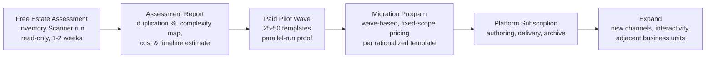
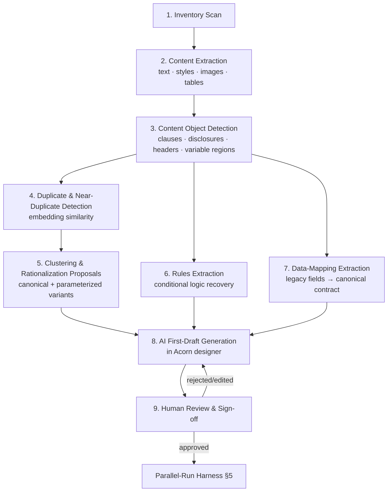
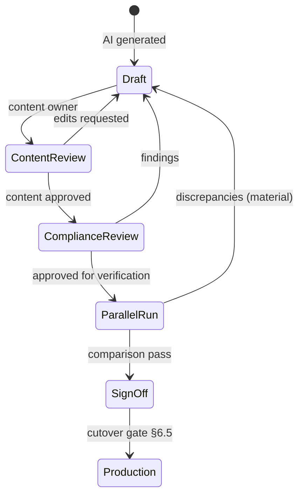
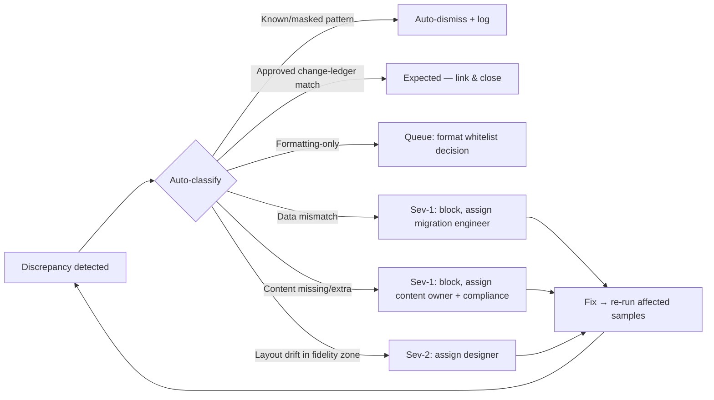
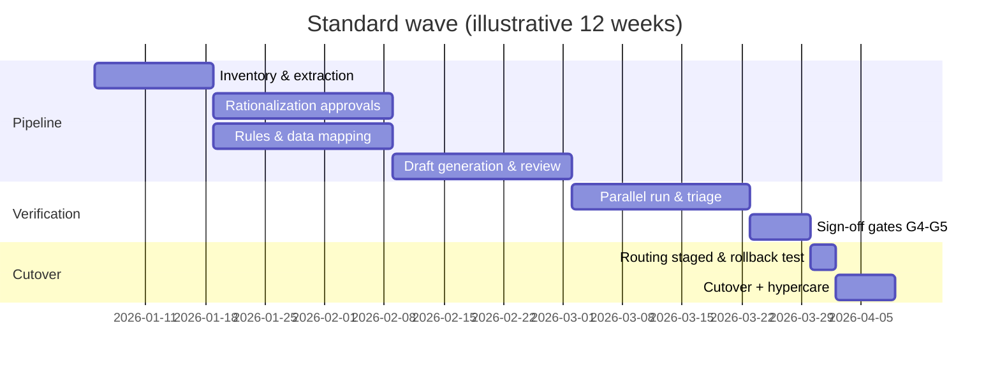
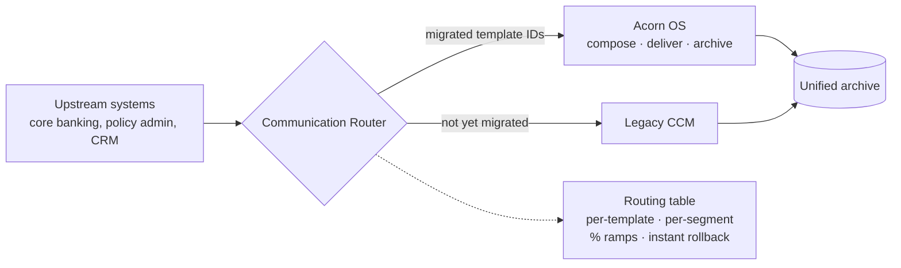

# 09 — Migration & Modernization Strategy

**Document owner:** Platform Architecture
**Status:** Build-ready draft v1.0
**Audience:** Engineering, Product, Professional Services, Sales Engineering, Partner Enablement
**Related docs:** `00-product-vision.md`, `03-competitor-matrix.md`

---

## 1. Migration Philosophy and the "Migration Studio" Product Concept

### 1.1 Philosophy: migration is the product, not a project

Every prospective Acorn OS customer already owns a legacy CCM estate — Quadient Inspire, OpenText Exstream, Smart Communications, Precisely EngageOne, Adobe (LiveCycle/AEM Forms/Central), Doxim, or a homegrown COBOL-and-Word-macros stack. The single largest objection to replacing any of these is: *"We have 3,000 templates and a decade of embedded business rules. We cannot re-author that."*

Our answer is that they should not re-author it — and they should not lift-and-shift it either. Legacy CCM estates are 60–85% redundant by content mass: cloned templates, forked disclosure variants, dead conditions, hardcoded values that were once data-driven, and print-era layouts that fail accessibility and mobile rendering. Copying that debt into a new platform recreates the old problem at new prices.

**Core tenets:**

1. **Migration is rationalization.** The pipeline's job is to emerge with *fewer, better* communications, not a 1:1 format conversion. Every migration produces a measurable dedup/rationalization dividend that we report to the customer.
2. **AI does the toil; humans do the judgment.** Parsing, extraction, clustering, rule recovery, and first-draft generation are machine tasks. Canonical-content selection, compliance sign-off, and brand decisions are human tasks with machine-prepared evidence.
3. **Nothing ships without proof.** Parallel-run verification with pixel, data, structural, accessibility, and compliance comparison is mandatory before cutover. Evidence is captured in regulator-ready form.
4. **Modernize at the moment of migration.** Migration is the one moment the organization touches every template. We use it to inject accessibility (WCAG 2.2 AA / PDF-UA), interactivity, digital delivery, and canonical data contracts — because the marginal cost of doing it *during* migration is a fraction of doing it after.
5. **Migration is the land-and-expand motion.** Migration Studio is a first-class, sellable product with its own dashboards, scoring, and estimator — usable in pre-sales as a free "estate assessment" that quantifies the customer's mess and prices the fix.

### 1.2 Migration Studio: the product

Migration Studio is a workspace inside Acorn OS (also deployable standalone for pre-sales assessments) comprising:

| Module | What it does | Primary persona |
|---|---|---|
| **Inventory Scanner** | Crawls repositories, file shares, legacy CCM APIs/exports; builds the estate inventory graph | Migration engineer |
| **Extraction Engine** | Format parsers + vision models; converts every source into the Acorn Intermediate Representation (AIR) | Automated |
| **Rationalization Workbench** | Duplicate detection, clustering, canonical-content proposals, merge/parameterize tooling | Content owner |
| **Rules & Data Recovery** | Recovers conditional logic and field mappings from legacy scripts into portable rule/contract objects | Migration engineer + BA |
| **Draft Generator** | AI-generated first-draft templates in the Acorn designer, tagged with provenance and confidence | Automated → designer |
| **Review & Sign-off** | Side-by-side legacy/new review, redline, approval workflow, audit trail | Compliance reviewer |
| **Parallel-Run Harness** | Batch regeneration against production data snapshots; five-way comparison; discrepancy triage | QA + migration engineer |
| **Migration Analytics** | Estate dashboards, per-template scoring, cost estimator, risk register, executive progress reporting | Program lead, exec sponsor |

### 1.3 The land-and-expand sales motion

- **Land:** the free assessment produces numbers no incumbent vendor will show the customer (their own duplication rate and per-template TCO). This is the wedge.
- **Prove:** the pilot wave is scoped to complete in 6–8 weeks and ends with a parallel-run evidence pack.
- **Expand:** every completed wave enlarges the subscription footprint; archive backfill and print-to-digital campaigns are attach products (§6.7, §7).
- **Pricing signal:** we price migration per *rationalized output template*, not per source template — aligning our revenue with the customer's cleanup, not their mess.

---

## 2. Source Ingestion Matrix

Every source format is normalized into the **Acorn Intermediate Representation (AIR)**: a JSON document graph of layout regions, styled content runs, content objects, variables, conditions, assets, and data references, each carrying provenance (source file, coordinates, extractor, confidence score).

### 2.1 Legacy CCM design formats

| Source | Extraction approach | Fidelity expectation | Known pitfalls |
|---|---|---|---|
| **Quadient Inspire (WFD/ICM)** | WFD is a proprietary binary/zipped XML hybrid. Primary path: customer-exported Inspire XML workflow export + ICM content export via Inspire APIs; parse workflow graph, layout modules, scripting objects. Fallback: render-to-PDF + vision reconciliation. | High (85–95%) for layout/content when XML export available; medium for workflow logic (Inspire scripting must be transpiled) | Nested workflow modules and shared "master" objects create hidden dependencies; Inspire script (proprietary) embeds data transformation that looks like layout logic; versioned ICM objects can diverge from what production actually renders — always reconcile against production output samples |
| **OpenText Exstream (design files: .pub/.pkg, Design Manager DB, Empower)** | Parse packaged export (XML-based CDF/design export from Design Manager/Designer); recover pages, sections, rules, variables, message objects. Fallback: HP Exstream reference-output diffing. | High (85–95%) for content and layout; medium (60–80%) for rule recovery (Exstream rule trees + embedded functions) | Design-DB exports may omit customizations applied via engine switches/DLLs; "messages" reused across hundreds of documents create tangled inheritance; frame-flow pagination logic rarely maps 1:1 — expect pagination diffs in parallel run |
| **Exstream Dialogue (legacy pre-OpenText)** | Same family as above but older schema versions; dedicated schema-version adapters; heavy reliance on production output samples for validation | Medium-high (75–90%) | Version drift — Dialogue 5.x vs 9.x exports differ materially; customers often lack a working Design Manager to export from (recover from .pub files directly) |
| **Precisely DOC1 / EngageOne (HIP files, DOC1 Series 5/6, Designer projects)** | Parse EngageOne Designer project exports (XML) and HIP publications; DOC1 Series 5 requires the legacy Work Center project format parser; recover logic maps and keymaps | Medium-high (75–90%); DOC1 Series 5 lower (60–80%) | Keymap/lookup-table logic hides business rules in data files, not the template; AFP-oriented positioning (fixed coordinates) resists reflow — flag for redesign rather than faithful conversion |
| **Smart Communications (SmartCOMM template packages)** | Parse exported template packages (XML-based); recover shared content blocks, script includes, data models (already XML-schema driven — best data-contract recovery of any source) | High (85–95%) | Heavy use of shared/inherited layouts means one exported template is meaningless alone — must export the full resource tree; JSON/XML data model versions must be pinned |
| **Adobe Central / Output Designer (IFD/MDF), LiveCycle** | IFD parser for form definitions; DAT/field-nominated data recovery; LiveCycle → treat as XDP (below) | Medium (65–85%) | Overlay-style design (preprinted-form mindset): content and form are entangled; JetForm-era field naming is cryptic — data mapping needs human confirmation |
| **xPression (EMC/OpenText; xDesign, xPressForWord)** | Parse xDesign document/category exports and Word-based authoring sources; rules live in xAdmin DB — extract via DB export | Medium-high (70–88%) | Rules split between the document and the xAdmin database; Word-authored content inherits every Word pitfall (§2.2) plus xPression variable syntax embedded in text |
| **Doxim / service-bureau formats** | Usually no design source available — ingest composition output (PDF/AFP print files) + spec documents; vision-first reconstruction | Medium (60–80%), redesign-oriented | Customer often does not own the design files (bureau IP); treat as output-only migration (§2.3) with contractual data-feed recovery |
| **Homegrown (Word macros, JSP/ASP, COBOL writers, JasperReports, etc.)** | Per-estate adapter sprints; source-code static analysis (LLM-assisted) to recover logic; output samples for layout | Variable (50–90%) | No two alike; budget adapter engineering per estate; the code *is* the spec — prioritize rule extraction from code over layout fidelity |

### 2.2 Document and structured formats

| Source | Extraction approach | Fidelity expectation | Known pitfalls |
|---|---|---|---|
| **PDF (digitally composed)** | Structural parser (text runs, fonts, vectors, images) + layout-analysis model for reading order, tables, regions; tagged PDFs use the tag tree as ground truth | High (90%+) for content; layout intent (why something is where it is) is inferred, not stated | Untagged PDFs have no reading order — columns/tables need vision models; Type 3/subsetted fonts break text extraction (OCR fallback); variable regions are invisible in a single PDF — need N samples per template to detect what varies |
| **PDF (scanned/image-only)** | OCR + vision-model layout interpretation; multi-sample variance analysis for variable-region detection | Medium (70–85%) | OCR errors in amounts/account numbers are dangerous — route all detected numerals through human verification; skew/stamps/handwriting degrade extraction |
| **Word (DOCX/DOC, incl. mail-merge)** | OOXML parser; styles, numbering, tables, content controls, merge fields map cleanly; legacy .DOC via converter | High (90–98%) | "Visual styling" (manual bold/spacing instead of styles) yields noisy style extraction — normalize during rationalization; nested field codes (IF fields inside merge fields) encode real business rules — must transpile, not flatten; floating text boxes break reading order |
| **HTML/email templates** | DOM parser; CSS computed-style resolution; template-language detection (Freemarker, Velocity, Handlebars, custom) with rule/variable extraction | High (90%+) | Table-based email layout ≠ semantic structure; inline-styled legacy email needs style consolidation; template-language conditionals are rules — extract them (§3.6) |
| **XML (content + composition control files)** | Schema-aware parser; where XSL-FO/XSLT present, parse stylesheets as first-class rule+layout sources | High for content; XSLT logic recovery medium (70–85%) | XSLT is Turing-complete — deep template/mode recursion needs LLM-assisted summarization plus exhaustive output-diff validation |
| **XDP (AEM Forms / LiveCycle Designer)** | Native XDP XML parser: subforms, fields, bindings, FormCalc/JavaScript events; data bindings map directly to data contract | High (85–95%) structure; scripts medium (70–85%) | Dynamic XFA (growing subforms) has no PDF/HTML5 equivalent 1:1 — map to Acorn repeating sections; FormCalc must be transpiled; XFA is deprecated everywhere — sell this as forced modernization, never re-emit XFA |
| **Spreadsheets (rate tables, matrices, content inventories)** | Tabular extraction; header/unit inference; formula→rule transpilation for embedded logic | High (90%+) for values; formulas medium | Merged cells and "formatting as meaning" (color = status); stale copies — always confirm which sheet is the system of record |
| **Screenshots / images of templates** | Vision-model interpretation: region detection, text OCR, style estimation, component classification (header, table, disclosure, signature block) | Low-medium (50–75%) — treated as *design brief*, not source of truth | Never the sole source for regulated content — pair with an authoritative text source; resolution/compression artifacts corrupt small print (exactly where disclosures live) |

### 2.3 Print streams and mainframe output

These are *output* formats: no design intent survives, only the rendered result. Strategy: reconstruct the template by analyzing **many instances** of the same document (variance analysis separates boilerplate from variable data), then treat as redesign-with-fidelity-checks rather than conversion.

| Source | Extraction approach | Fidelity expectation | Known pitfalls |
|---|---|---|---|
| **AFP (MO:DCA, incl. AFP archives)** | Native AFP parser: PTX text, page segments, overlays, IOB images, TLE index tags (gold for archive backfill §6.7); resolve coded fonts via customer font libraries | High (85–95%) for text/position; overlays give clean boilerplate/variable separation | Missing font libraries (charset→codepage mapping) garble text; EBCDIC code pages; overlays referenced but not shipped; N-up/simplex-duplex print logic pollutes logical page structure |
| **PCL** | PCL interpreter → positioned text + raster; macro detection isolates repeated boilerplate | Medium-high (75–90%) | PCL macros with printer-resident resources unrecoverable without the resource files; downloaded soft fonts without headers require glyph-recognition fallback |
| **PostScript** | Interpret via Ghostscript instrumentation → positioned text/graphics; procedure (procset) analysis identifies repeated components | Medium-high (75–90%) | Custom encodings and re-encoded fonts; content generated inside PS procedures (computed layout) needs execution tracing, not static parsing |
| **Metacode / DJDE (Xerox)** | Dedicated Metacode parser; JDE/JDL job descriptors recover form/font invocation | Medium (65–85%) | JSL libraries often lost; FSL forms must be recovered or vision-reconstructed from printed samples |
| **Line data / mainframe report output (ANSI/machine carriage control)** | Carriage-control-aware parser; column-position inference; pairs with AFP page definitions (PAGEDEF/FORMDEF) when available to recover intended formatting | Medium (60–85%) | EBCDIC + packed-decimal remnants; column meaning is positional convention only — requires SME confirmation; PAGEDEF logic is effectively a template language and must be transpiled |

**Cross-cutting rule:** for every source, ingest **production output samples** (≥30 instances per template where volume permits) alongside design sources. Samples power variable-region detection, validate parser fidelity, and later seed the parallel-run harness.

---

## 3. AI Extraction Pipeline

Every stage writes to the estate graph with provenance and confidence; nothing is destructive; every AI proposal is a *proposal object* a human accepts, edits, or rejects.

### Stage 1 — Inventory scan

- **Inputs:** file shares, legacy CCM repositories/APIs, source control, output archives, spool captures, SharePoint, email-template stores.
- **Actions:** recursive crawl; format identification (magic bytes + structure probes, not extensions); dependency resolution (fonts, images, includes, shared objects); usage-signal join (production volume logs, last-composed date, channel); ownership inference (repo metadata, file ACLs, naming conventions).
- **Outputs:** estate inventory graph — every asset, its format, dependencies, production usage, and an initial *dead/alive* classification. Typical finding: 20–40% of inventoried templates have zero production volume in 24 months → candidates for **retire without migration** (the cheapest migration is none).
- **SLA:** read-only; runs at assessment stage (§1.3) with zero legacy-system changes.

### Stage 2 — Content extraction

- Format-specific extractors (§2) produce AIR: styled text runs (font, size, weight, color, language), images (with perceptual hashes), tables (structure + cell content), layout regions (coordinates, flow order), page geometry, embedded metadata.
- Vision models fill parser gaps: reading order for untagged PDFs, table structure in print streams, region semantics in screenshots.
- **Quality gate:** per-template extraction confidence score; templates <0.85 confidence auto-route to "assisted extraction" queue (human confirms ambiguous regions in a click-to-confirm UI, which also generates parser training data).

### Stage 3 — Content object detection

Classifier + LLM pass segments extracted content into typed **content objects**:

| Object type | Detection signals | Why it matters |
|---|---|---|
| Clause / disclosure / legal text | Density, register, citation patterns ("pursuant to", reg references), placement (footer/small print), cross-template repetition | Compliance-critical; primary rationalization target |
| Header / footer / masthead | Position recurrence across pages/templates, logo proximity | Becomes shared brand components |
| Transactional table | Table structure + numeric density + column-header vocabulary | Maps to data-driven repeating sections |
| Variable region | Cross-sample variance (from production samples), merge-field markers, font/box anomalies | Becomes bound variables in the data contract |
| Signature block, address block, barcode/OMR, remittance stub | Pattern libraries per domain | Channel/print-logistics handling |
| Marketing / editorial block | Register, imagery adjacency, campaign markers | Candidates for dynamic-content slots |

Each object gets a stable content-object ID, a normalized text form, and links to every template that contains it.

### Stage 4 — Duplicate and near-duplicate detection

- **Exact dupes:** normalized-text hash (whitespace/punctuation/case-folded) → equivalence classes.
- **Near-dupes:** text-embedding vectors per content object; ANN index over the estate; pairs above cosine **0.97** flagged *duplicate*, **0.90–0.97** flagged *variant* (same content, differing parameters — dates, amounts, product names, jurisdictions), **0.80–0.90** flagged *related* (review-worthy).
- **Diff overlay:** for every variant pair, a token-level diff highlights exactly what differs — the diff is the input to parameterization (Stage 5).
- **Visual dupes:** perceptual hashing + image embeddings catch logo/graphic duplication (typically dozens of subtly different logo files; migration picks one).
- Thresholds are tunable per object type: disclosures use stricter thresholds (0.985 for auto-dupe) because a two-word difference in a disclosure can be legally material; marketing copy uses looser ones.

### Stage 5 — Similar-content clustering and rationalization proposals

- Graph clustering (community detection over the similarity graph) groups variants into **families**.
- For each family the LLM drafts a **rationalization proposal**: one canonical content object + a parameter schema + a variant matrix showing how each legacy instance maps onto (canonical, parameter values), plus a list of *unexplained residue* — text differences the parameterization can't express, each flagged for human decision (real business difference vs. historical drift).
- **Worked pattern:** an estate holds 1,400 disclosure variants. Clustering yields ~120 families; ~40 families collapse to a single canonical each; ~80 families become canonical + parameters (jurisdiction, product, effective date). Result: **1,400 → ~80 canonical disclosures + parameter tables**, each with full provenance back to every legacy source. Content owners approve family by family; approving a family retires every member variant with an audit-trail link.
- Rationalization also runs at **template level**: templates whose object composition overlaps >85% are proposed for merge into one template + condition/parameter.

### Stage 6 — Rules extraction

- **Sources of logic:** Inspire scripts, Exstream rule trees/functions, DOC1 logic maps and keymaps, SmartCOMM scripts, Word IF-field codes, XSLT, FormCalc/JS in XDP, template-language conditionals, homegrown code, and spreadsheet formulas.
- **Method:** per-language transpilers where grammar is known; LLM-assisted lifting for opaque/proprietary scripts — the model proposes an equivalent rule in Acorn's declarative rule language, and the proposal is validated by **behavioral equivalence testing**: execute legacy sample data through both old rendering (or recorded outputs) and the lifted rule, compare decisions. Rules that pass N≥50 diverse samples with 100% agreement are auto-accepted with "behaviorally verified" status; divergent rules route to a BA workbench showing the exact inputs that diverge.
- **Dead-logic detection:** conditions that never fired across the production sample corpus are flagged (typical estates: 15–30% of branches dead). Dead branches are *not* migrated silently — they appear as explicit "propose to drop" items with evidence.
- **Output:** portable rule objects (decision tables where possible — decision tables are reviewable by compliance humans; free-form expressions only when unavoidable), each linked to the templates and content objects it governs.

### Stage 7 — Data-mapping extraction

- Harvest every field reference across the estate (merge fields, Inspire data inputs, Exstream variables, DOC1 keymaps, XDP bindings, XSLT XPaths, positional columns in line data).
- Cluster field references by name similarity + value-distribution similarity (from production samples): `CUST_NM`, `CustomerName`, `cust_full_name`, and column 12–41 of the statement feed are proposed as one canonical field.
- LLM proposes the **canonical data contract** (typed JSON Schema; entities: party, account, transaction, product, communication metadata) plus per-legacy-source **mapping adapters** (rename, type-cast, format, code-table translation).
- Data-quality profiling runs alongside: null rates, format inconsistencies, code values with no dictionary entry — all feed the cost estimator (§4.3) and the risk register (§4.4), because data quality is the #1 hidden migration cost.

### Stage 8 — AI first-draft template generation

- Composer assembles: rationalized content objects + recovered rules + data-contract bindings + a **modern layout** in the Acorn designer — semantic structure (real headings, real tables, tagged reading order), design tokens from the customer's brand kit, responsive/channel-adaptive layout, accessibility built in (WCAG 2.2 AA, PDF/UA output).
- Two generation modes per template, chosen by migration scoring (§4.2):
  - **Fidelity mode** (regulated print, pixel expectations): preserve legacy layout geometry closely; modernization limited to structure/tagging under the hood.
  - **Modernization mode** (default): re-layout on the Acorn design system; legacy output kept as reference, not target.
- Every generated element carries provenance chips (source file, page, extractor, confidence) visible in the designer, so reviewers always know what the AI was looking at.

### Stage 9 — Human review and sign-off workflow

- Side-by-side viewer: legacy output vs. new output vs. structured diff; reviewers annotate at the element level.
- Compliance reviewers see a **change ledger**: every difference from legacy is classified (rationalization-approved, modernization-intentional, correction, unexplained) — unexplained differences block sign-off.
- All approvals are recorded with identity, timestamp, artifact hashes; this record becomes part of the regulator evidence pack (§5.5).

---

## 4. Rationalization Analytics

### 4.1 Migration dashboards

| Dashboard | Key tiles | Audience |
|---|---|---|
| **Estate Overview** | Inventory size by format/system/BU; alive vs. dead (24-mo volume); dependency-graph health (missing fonts/assets) | Program lead, exec |
| **Duplication & Rationalization** | Duplication rate (% content mass in dupe/variant classes); families identified; canonical objects approved; **rationalization savings** (source objects → canonical objects, projected annual maintenance-hours saved) | Content owners, exec |
| **Complexity Distribution** | Histogram of migration scores (§4.2); rule density per template; format-fidelity risk heatmap | Migration engineers |
| **Pipeline Progress** | Templates per stage (funnel), throughput/week, review queue aging, auto-acceptance rate vs. assisted rate | Program lead |
| **Verification** | Parallel-run pass rates by comparison type; open discrepancies by severity; sign-off gate status per wave | QA, compliance |
| **Value Realization** | Templates cut over; legacy volume % remaining; accessibility score uplift; digital-delivery adoption (§7) | Exec sponsor |

All tiles drill to template-level detail; the exec view exports as a board-ready PDF (also our expand-sales artifact).

### 4.2 Migration scoring per template

Each template gets three 0–100 scores, computed from the estate graph:

| Score | Drivers (weighted) | Use |
|---|---|---|
| **Complexity** | Rule count & nesting depth (30%), variable-region count (15%), page/section count (10%), table complexity (10%), source-format fidelity class §2 (20%), shared-object fan-in (15%) | Wave assignment; fidelity vs. modernization mode; effort estimate input |
| **Risk** | Regulatory classification (35%), production volume (20%), data-quality issues on bound fields (15%), extraction confidence inverse (15%), unexplained variant residue (15%) | Review depth, compliance routing, parallel-run sample size |
| **Effort** | f(complexity, source format, data-mapping novelty, review persona availability) → hours estimate with P50/P90 band | Costing, capacity planning |

Bands: **Simple** (complexity <30), **Standard** (30–60), **Complex** (60–85), **Exceptional** (>85 — architect-led, individually planned).

### 4.3 Migration cost estimator model

`Effort = Σ_templates [ base(format) × complexity_multiplier × rule_density_factor × data_quality_factor ] × (1 − rationalization_rate × reuse_credit) + fixed(program)`

| Driver | Effect | Calibration |
|---|---|---|
| Template count (post-rationalization) | Linear on variable cost | The estimator prices *canonical outputs*; rationalization directly cuts the bill — sales-visible |
| Rule density | Multiplier 1.0–3.5× | Rules/template percentile within estate |
| Source format | Base hours per format class (Word/HTML low; WFD/Exstream medium; print-stream/screenshot high) | Table maintained from delivery actuals; every completed wave feeds back |
| Data quality | Multiplier 1.0–2.0× | Profiling defect rate on bound fields |
| Rationalization rate | Discount | % of estate collapsing into already-approved canonicals; later waves get cheaper — the model shows this curve, which is a powerful sales visual |
| Fixed program costs | Environment setup, data-feed adapters, parallel-run infra, PM | Per-estate, per-wave |

Output: P50/P90 cost and duration per wave, refreshed continuously as pipeline actuals land (estimate-vs-actual variance is itself a dashboard tile).

### 4.4 Risk assessment framework

| Risk class | Examples | Detection | Mitigation |
|---|---|---|---|
| **Fidelity** | Pagination drift, font substitution, print-stream reconstruction gaps | Extraction confidence, format class, parallel-run pixel diffs | Fidelity mode, font licensing workstream, expanded sample sizes |
| **Regulatory** | Disclosure wording drift, missing required content, timing rules | Compliance classification + change ledger | Mandatory compliance gate; canonical-disclosure library with legal sign-off before template work |
| **Data** | Field misinterpretation, code-table gaps, EBCDIC/encoding errors | Profiling, mapping-confidence scores, value-distribution shifts | Data-comparison harness (§5.2); SME confirmation queue for low-confidence mappings |
| **Logic** | Mis-lifted rules, dead-branch misclassification | Behavioral-equivalence test coverage | Minimum sample coverage per rule; divergence auto-blocks |
| **Operational** | Cutover routing errors, archive chain-of-custody breaks, legacy-system retirement dependencies | Coexistence-router audit logs, backfill manifests | Rollback design (§6.6), custody manifests (§6.7) |
| **Program** | Reviewer bottlenecks, scope creep, legacy-vendor obstruction (export access) | Queue aging, throughput trend | Reviewer capacity model per wave; contractual export clauses in SOW; output-only fallback path (§2.3) |

Each wave carries a living risk register; **Exceptional**-band templates each get an individual risk record.

---

## 5. Parallel-Run and Verification

### 5.1 Output comparison harness — five comparators

| Comparator | Method | Pass criteria (default, tunable per template class) |
|---|---|---|
| **Pixel** | Rasterize legacy & new output at 300 DPI; SSIM + per-pixel diff **with tolerance zones**: masked regions (timestamps, barcodes, page IDs), positional tolerance (±2 px anti-aliasing), and *modernization zones* where layout intentionally differs (excluded from pixel scoring, covered by structural comparator instead) | Fidelity-mode: SSIM ≥ 0.99 outside masks; Modernization-mode: pixel comparison applies only to fidelity-pinned regions (logos, sig blocks, barcodes) |
| **Data** | Extract every variable value from both outputs (via composition-engine instrumentation on the new side; extraction on the legacy side); compare normalized values (amount, date, name, account) field-by-field | 100% equality on financial/identity fields; formatting-only diffs allowed if whitelisted (e.g., `1,000.00` vs `1000.00` per approved format change) |
| **Structural** | Compare document object trees: section presence/order, table row/column counts, clause inclusion set, page-count band | All required content objects present; conditional-inclusion decisions identical to legacy for the same input record |
| **Accessibility** | Score both outputs (axe-core/PDF-UA validators + manual-audit sampling): tag coverage, reading order, contrast, alt text | New score ≥ target (WCAG 2.2 AA / PDF-UA pass) **and** ≥ legacy score; regressions impossible by construction, uplift is reported (§7) |
| **Compliance** | Rule-based checks: required disclosures present for the record's jurisdiction/product, correct versions by effective date, mandated placement/prominence; diff against canonical-disclosure library | Zero missing/incorrect mandatory content; any diff from legacy must map to an approved change-ledger entry |

### 5.2 Batch parallel runs against production data snapshots

- **Snapshot sourcing:** masked/tokenized production data extracts (PII pseudonymized with format preservation so rendering paths are exercised realistically); minimum sample size per template scaled by risk score — Simple: 100 records; Standard: 1,000; Complex/regulated: 10,000+ or one full production cycle.
- **Coverage engine:** samples are selected for *branch coverage*, not randomly — the rules extracted in Stage 6 define the condition space; the sampler picks records to exercise every live branch (and confirms dead branches stay dead).
- **Execution:** legacy outputs come from recorded production archives where possible (zero legacy-system load), or a legacy replay environment where not; new outputs from the Acorn composition engine; both sides content-addressed (hashed) and stored immutably.
- **Scale:** harness is horizontally parallel; a 10k-record five-comparator run on a statement template completes in under an hour.

### 5.3 Discrepancy triage workflow

- Discrepancies are deduplicated by pattern (one root cause producing 4,000 identical diffs = one triage item with 4,000 attachments).
- Severity ladder: **Sev-1** (data/content correctness — blocks sign-off), **Sev-2** (fidelity/visual — blocks in fidelity mode), **Sev-3** (cosmetic/whitelistable).
- Every dismissal requires a reason code and reviewer identity — dismissals are part of the evidence pack.

### 5.4 Sign-off gates

| Gate | Requirement |
|---|---|
| G1 Extraction | Extraction confidence ≥ threshold or assisted-review complete |
| G2 Rationalization | All content-object families used by the template approved by content owner |
| G3 Rules & data | All rules behaviorally verified; all field mappings confirmed |
| G4 Parallel run | All five comparators pass at sample size for risk band; zero open Sev-1/Sev-2 |
| G5 Business sign-off | Content owner + compliance reviewer e-sign against the evidence pack |
| G6 Cutover readiness | Routing config staged, rollback tested, ops runbook accepted |

### 5.5 Evidence capture for regulators

Per template, an immutable **evidence pack**: source inventory references, extraction provenance, rationalization decisions with approver identities, rule behavioral-equivalence results, parallel-run statistics (sample sizes, pass rates, every discrepancy and its disposition), change ledger, accessibility scores before/after, gate sign-offs. Stored WORM, exportable as a single sealed PDF/A + machine-readable bundle. This is the artifact a bank shows its examiner when asked *"prove the new statements are equivalent."*

---

## 6. Migration Execution Playbook

### 6.1 Phased waves

| Wave | Scope | Purpose | Typical duration |
|---|---|---|---|
| **Wave 0 — Pilot** | 25–50 templates: a representative slice (some Simple, a few Standard, 1–2 Complex) across formats | Prove the pipeline on this estate; calibrate estimator; train customer reviewers; produce the first evidence pack | 6–8 weeks |
| **Wave 1 — High-volume simple** | Simple + Standard band, highest production volume first | Maximum volume moved to the new platform fast (accelerates legacy cost drawdown); rationalization library grows fastest here | 2–4 months |
| **Wave 2..n — Complex regulated** | Complex band, regulated lines of business, exceptional templates | Deep compliance engagement; benefits from mature canonical library and calibrated pipeline | 2–3 months per wave |
| **Wave F — Decommission** | Retire-without-migration list confirmed; legacy licenses terminated; archive backfill complete | Realize savings | 4–8 weeks |

Wave assignment is driven by migration scores + business grouping (a product line's templates travel together so its content owner reviews once).

### 6.2 Roles

| Role | Responsibilities | Staffing rule of thumb |
|---|---|---|
| **Migration engineer** (Acorn or partner) | Pipeline operation, extraction QA, rule verification, discrepancy fixes, cutover execution | 1 per ~40 templates/month throughput |
| **Content owner** (customer) | Rationalization approvals, draft review, business sign-off | 2–4 h/week per active product line |
| **Compliance reviewer** (customer) | Canonical-disclosure approval, change-ledger review, G5 sign-off | Front-loaded on disclosure library; then per-wave gate reviews |
| **Data/integration engineer** | Feed adapters, snapshot provisioning, canonical-contract confirmation | 1 per estate, tapering |
| **Migration program lead** | Wave planning, risk register, exec reporting | 1 per program |
| **Solution architect** | Exceptional templates, coexistence routing design, decommission plan | Fractional |

### 6.3 Tooling

Migration Studio (all modules §1.2) + customer-side: read-only legacy export credentials, snapshot data pipeline, legacy replay environment (or archive access), font/asset libraries. Partner enablement kit: certified-partner training on the same tooling — partners run waves, Acorn runs the platform (scales delivery without scaling our services org).

### 6.4 Timeline template (per standard wave)

### 6.5 Cutover strategy

- **Routing-flip cutover:** the coexistence router (§6.8) switches a template ID from legacy to Acorn per template (or per segment: e.g., 5% of accounts → 50% → 100% over three cycles for high-volume regulated documents).
- **Hypercare:** first N production cycles post-cutover run *shadow comparison* — legacy remains warm, its output compared against live Acorn output; alerts on drift.
- **Cutover calendar** respects business cycles: never cut a statement template mid-cycle; never cut tax documents in season.

### 6.6 Rollback strategy

- Router flip-back is a config change (<5 min), pre-tested at G6 with a live drill.
- Legacy stays warm (licensed, data feeds connected) for a defined post-cutover window per wave (default: 2 production cycles), then moves to cold standby, then decommission.
- Rollback triggers are pre-agreed and objective: Sev-1 production discrepancy rate above threshold, delivery-SLA breach, compliance directive. Every rollback generates a root-cause record before re-cutover is permitted.

### 6.7 Archive backfill

Legacy statement-of-record archives (often AFP/PDF in ECM or bureau vaults) migrate into Acorn's archive with **chain-of-custody preservation**:

- **Manifest-first:** source archive enumerated; per-object checksums recorded *before* movement; counts and hashes reconciled after — the custody manifest proves nothing was altered or lost.
- **Preserve originals:** the legacy rendition is the record; we store the original bytes untouched (AFP kept as AFP alongside an access rendition — tagged PDF/A generated from it, clearly marked *rendition*, never replacing the original).
- **Index recovery:** AFP TLE tags, filename conventions, and ECM metadata map into the canonical archive index (party, account, doc type, date); vision/OCR fallback for index gaps, with confidence flags.
- **Retention mapping:** legacy retention/hold policies mapped and re-attested by records management before legacy vault retirement.
- Backfill is a distinct sellable workstream — priced per million objects — and a strong expand motion after Wave 1.

### 6.8 Coexistence patterns

- **Routing layer:** a thin service in front of composition requests keyed on template ID (+ optional segment ramp). Owned by the customer, config-driven, fully audit-logged. Where upstreams call legacy directly, the router deploys as a façade emulating the legacy API and forwarding un-migrated calls unchanged.
- **Unified archive during coexistence:** both engines write (or replicate) to the Acorn archive so customer service sees one history regardless of composing engine.
- **Shared-content bridge (optional):** for long coexistence periods, approved canonical disclosures can be exported back into legacy templates so a regulatory wording change is made once — a strong incentive for the customer to accelerate, not prolong, coexistence.
- **Anti-pattern guardrails:** coexistence windows are time-boxed per wave in the program plan; the value-realization dashboard shows legacy % remaining and legacy run-rate cost to keep decommission pressure visible.

---

## 7. Print-to-Digital Modernization

### 7.1 Migration as the modernization moment

Because Stage 8 regenerates every template with semantic structure and a canonical data contract, digital capability is nearly free at migration time:

| Modernization | How migration enables it | Default policy |
|---|---|---|
| **Accessibility** | Semantic regeneration → tagged reading order, real headings/tables, alt text (AI-drafted, human-approved), contrast-checked tokens | Mandatory: every migrated template ships WCAG 2.2 AA / PDF-UA |
| **Responsive digital rendition** | Channel-adaptive layout from the same AIR content → HTML/email/portal/mobile renditions alongside print | Generated by default; enablement per business decision |
| **Interactivity** | Variable regions + data contract → expandable transaction detail, in-document calculators, guided explanations, click-to-act (dispute a charge, update preferences) | Proposed per template family; content owner opts in |
| **Personalized dynamic content** | Marketing/editorial blocks detected in Stage 3 become governed dynamic slots | Opt-in with governance rules |
| **Notifications & delivery** | Canonical metadata (party, doc type) → email/SMS/push delivery events and portal posting | Configured per wave |

### 7.2 Print-to-digital migration analytics

Dashboard tiles per estate/wave: print volume by template family and unit cost (print+postage); **digital-readiness score** per template (does a digital rendition exist, is delivery wired, is consent captured); projected annual savings at 25/50/75% digital adoption; accessibility uplift (legacy vs. new scores — usually the single most dramatic before/after number); suppression eligibility (regulatory constraints on mandatory paper by doc type and jurisdiction, maintained as rules).

### 7.3 Customer preference capture campaigns

Migration creates the natural touchpoint: the first Acorn-composed communication for each recipient can carry a **preference-capture module** (QR/short-link on print; inline in email/portal) offering digital delivery with one-tap consent, recorded in the preference service with evidentiary consent capture (timestamp, channel, wording version — required for e-delivery regulations like E-SIGN).

Campaign playbook: (1) launch with Wave 1 high-volume templates for maximum reach; (2) A/B test incentive framing; (3) respect suppression rules — never solicit e-delivery where paper is mandated; (4) report adoption per template family into the value-realization dashboard. Typical results to set expectations: 8–15% adoption from passive print QR alone in year one; 30–50% where the customer pairs it with portal/app prompts.

---

## 8. Success Metrics and Worked Example

### 8.1 Program success metrics

| Metric | Definition | Target (typical program) |
|---|---|---|
| Rationalization ratio | Source templates → canonical templates | ≥ 3:1 on mature estates |
| Content dedup ratio | Source content objects → canonical objects | ≥ 10:1 on disclosures |
| Auto-migration rate | Templates passing G1–G4 without human rework beyond review | ≥ 70% Simple band, ≥ 40% Standard |
| Parallel-run first-pass rate | Templates passing all comparators on first batch | ≥ 60%, rising per wave |
| Estimate accuracy | P50 effort vs. actual, per wave | ±15% by Wave 2 |
| Cutover quality | Sev-1 production discrepancies per million documents post-cutover | < 1; zero regulatory findings |
| Accessibility uplift | % migrated output passing WCAG 2.2 AA / PDF-UA | 100% (from typically <10%) |
| Legacy drawdown | Legacy production volume remaining | 0% by program end + decommission executed |
| Digital adoption | E-delivery consent on migrated families | Per §7.3 benchmarks |

### 8.2 Worked example — regional bank, two legacy systems

**Starting estate:** 3,200 templates — 2,100 in OpenText Exstream (statements, notices, letters; design DB available) and 1,100 in Precisely EngageOne/DOC1 (loan servicing and collections; Series 6 exports available, ~200 templates Series 5 output-only). Archives: 310M AFP statements in an ECM vault. Annual production: ~95M documents, 78% print.

**Assessment findings (2-week Inventory Scanner run):**

| Finding | Value |
|---|---|
| Dead templates (zero volume, 24 mo) | 740 (23%) — retire without migration |
| Duplicate/variant template families | 2,460 live templates → 890 families |
| Disclosure variants | 1,380 → clustering projects ~85 canonical + parameters |
| Complexity mix (live) | Simple 41% · Standard 38% · Complex 18% · Exceptional 3% (74 templates) |
| Data feeds | 6 feeds, 2 with material quality issues (code-table gaps in collections) |

**Projected rationalization: 3,200 source → ~900 canonical templates** (740 retired, 2,460 → ~900 via family merges), i.e., a 3.6:1 ratio. The customer's incumbent renewal quote priced maintenance on 3,200.

**Effort model (estimator P50):**

| Band | Templates (canonical) | Hrs/template P50 | Subtotal |
|---|---|---|---|
| Simple | 370 | 6 | 2,220 h |
| Standard | 340 | 16 | 5,440 h |
| Complex | 160 | 40 | 6,400 h |
| Exceptional | 30 | 110 | 3,300 h |
| Fixed (feeds, replay env, router, program) | — | — | 3,800 h |
| **Total** | **900** | | **~21,200 h P50 (P90 ~26,500 h)** |

≈ 11–13 FTE-years, delivered by a blended Acorn/partner pod of 8 over the program timeline below — versus an internal re-authoring estimate of 3,200 × 25 h ≈ 80,000 h. The rationalization dividend *is* the business case.

**Three-wave timeline:**

| Wave | Scope | Duration | Exit criteria |
|---|---|---|---|
| **W0 Pilot** (mo 1–2) | 40 templates: 25 Simple deposit notices, 12 Standard letters, 3 Complex statement variants; disclosure library seeded (85 canonicals drafted, 60 approved) | 8 weeks | Evidence pack accepted by internal audit; estimator recalibrated (came in −9% vs. P50) |
| **W1 High-volume simple** (mo 3–7) | 620 Simple+Standard canonicals covering 71M annual docs; DDA/savings statements cut over with 5%→50%→100% segment ramp; preference-capture module live | 5 months | 100% of Simple band in production on Acorn; legacy Exstream volume down 74% |
| **W2 Complex regulated** (mo 8–12) | 240 Complex/Exceptional canonicals: loan servicing, collections (incl. 200 DOC1 output-only rebuilds), regulatory notices; archive backfill (310M objects) runs in parallel | 5 months | All gates passed incl. compliance G5 on collections; both legacy systems to cold standby mo 12, decommissioned mo 14 |

**Parallel-run statistics (actuals-style projection):**

| Measure | W0 | W1 | W2 |
|---|---|---|---|
| Records compared | 60k | 2.1M | 1.4M |
| First-pass rate (all 5 comparators) | 55% | 68% | 61% |
| Discrepancy root causes found | 41 | 96 | 118 |
| — of which legacy defects discovered | 6 | 19 | 27 (incl. 2 disclosures missing in legacy for an entire product segment — reported to compliance as a migration *finding*, remediated in the new templates) |
| Sev-1 post-cutover (per 1M docs) | 0 | 0.4 | 0.2 |
| Accessibility pass (WCAG 2.2 AA/PDF-UA) | legacy 4% → new 100% | 100% | 100% |

**Business outcomes at month 14:** 900 templates maintained instead of 3,200 (−72% maintenance surface); both legacy licenses terminated; disclosure changes now made once against 85 canonicals instead of ~1,380 edits; 100% accessible output (previously an open regulatory finding); 19% e-delivery adoption on statement families in year one → ~$2.1M annual print/postage reduction at current adoption, with a $5M+ path at 50%. The evidence packs from W2 were provided to the bank's examiner during a routine exam with zero follow-up findings — and the case study became the reference asset for the next three deals in the segment.

---

*End of document.*
